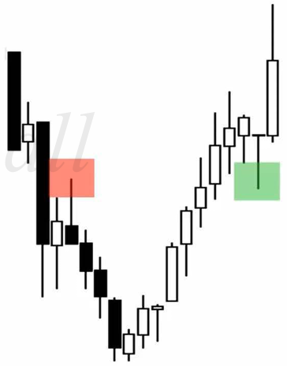
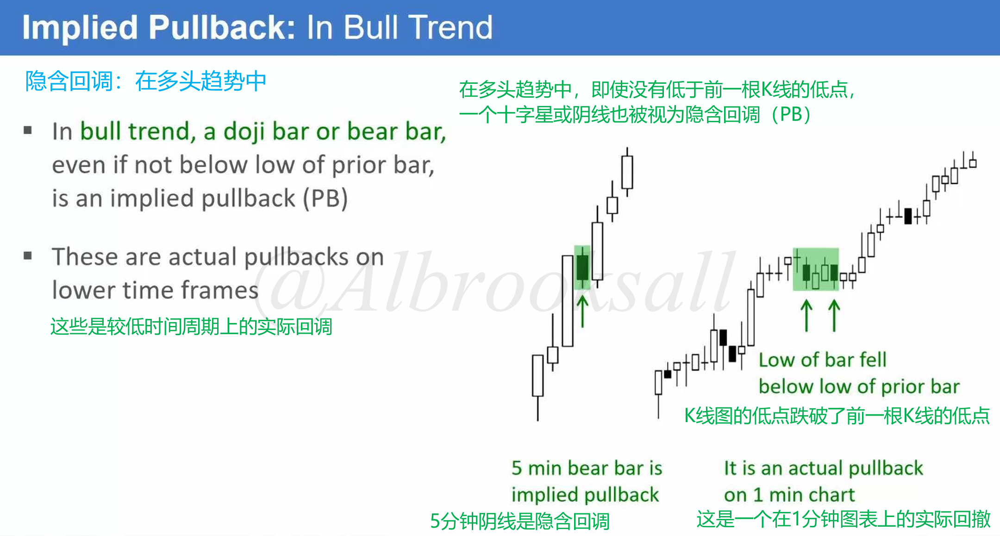
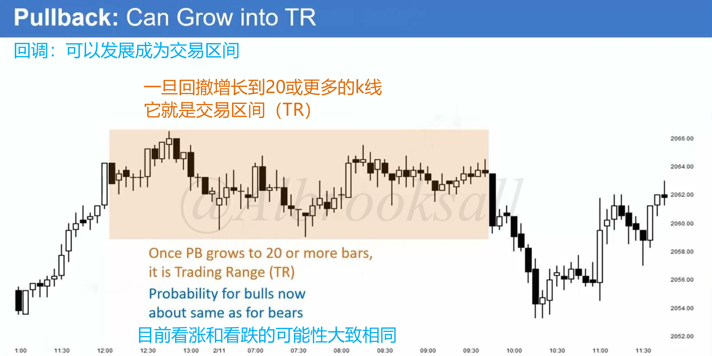
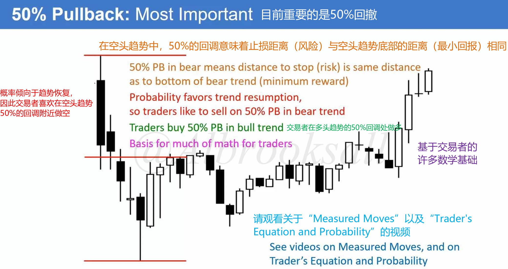
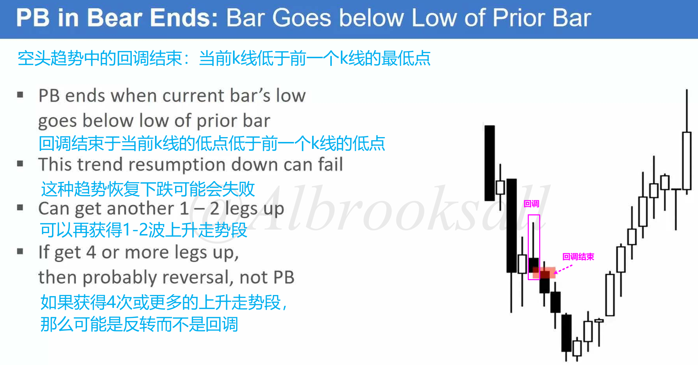
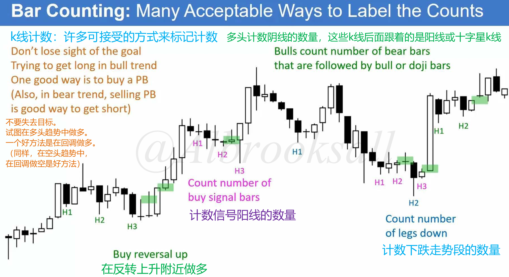
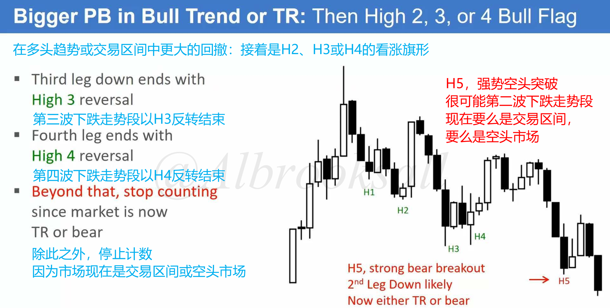

# 09A

## 回调（Pullback）

### 回调的最低要求

回调的最低要求：

- 上涨趋势中的回调：指某根 K 线的最低点低于前一根 K 线的最低点。
- 下跌趋势中的回调：指某根 K 线的最高点高于前一根 K 线的最高点。

交易目的：**回调是趋势中的暂时停顿，为交易者提供高胜率的入场机会**。

隐含回调：在当前时间周期（如5分钟图）上，一根阴线或带有长上影线的K线，即使其低点未低于前一根K线，也暗示着在更小的时间周期（如1分钟图）上已经发生了一次回调。

### 回调演变为交易区间

时间因素导致性质转变：当回调增长到20或更多的K线，就会演变为交易区间，此时趋势延续和反转概率趋向于50%/50%，交易者应该从“回调买入”的思路转变为“交易区间”的策略。

背后原因：趋势延续过久，导致止损位（起涨/起跌点）过远，风险增大。机构为控制风险会分批止盈，从而引发回调或横盘。

### 强趋势为何会出现回调？

以上涨趋势为例，多头投资者为了防止风险过大会逐步获利了结，市场就会出现回调，并可能陷入横盘整理。

在后续一旦多头确信空头将无非逆转多头趋势，多头就会再次买入做多。

### 50%回调

核心逻辑：在一段趋势腿的50%位置，**顺势交易者和逆势交易者的潜在盈亏比是相同的**（1:1）（目标为前期高/低点，止损为波段起/终点）。

概率优势：在趋势背景下，顺势方的胜率更高（例如60% vs 40%）。这使得50%水平成为一个具有数学优势的、机构非常青睐的入场点。

应用：交易者常在上涨趋势的50%回调位挂限价单买入，或在下降趋势的50%反弹位挂限价单卖出。

### 回调的结束

上涨行情回调结束：当前K线高于前一个K线最高点。

下跌行情回调结束：当前K线低于前一个K线最低点。

## 数K线

### 如何数K线？

上涨趋势：将尝试恢复上涨的信号点依次命名为高1（H1）、高2（H2）、高3（H3）等。

下降趋势：将尝试恢复下跌的信号点依次命名为低1（L1）、低2（L2）、低3（L3）等。

- 高1/低1：趋势回调/反弹后的第一次恢复尝试。在强趋势中，这通常就是很好的入场点。
- 高2/低2：第二次恢复尝试。所有**双底**都是高2买入形态，所有**双顶**都是低2卖出形态。
- 高3/低3：第三次恢复尝试。通常形成**三推楔形**（Wedge）或**三角形**（Triangle）形态。

注意事项：**如果计数达到4次或5次以上，说明原趋势很可能已经结束，并转变为反向趋势或震荡区间**。此时应停止使用原方向的计数，并重新评估市场。

> 上涨趋势的尝试恢复：底分型或长下影线阳线
>
> 下跌趋势的尝试恢复：顶分型或长上影线阴线

### 4次计数后趋势状态会转变

如下图所示，H4出现后就可以停止计数了，因为市场状态演变了，现在是交易区间或空头市场。

