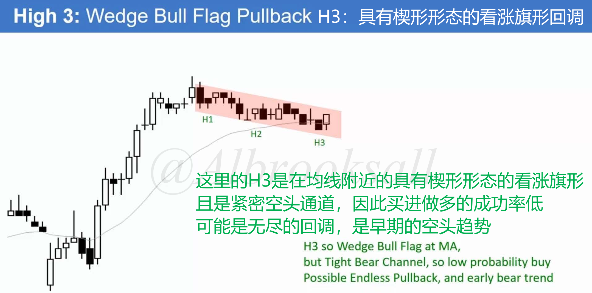
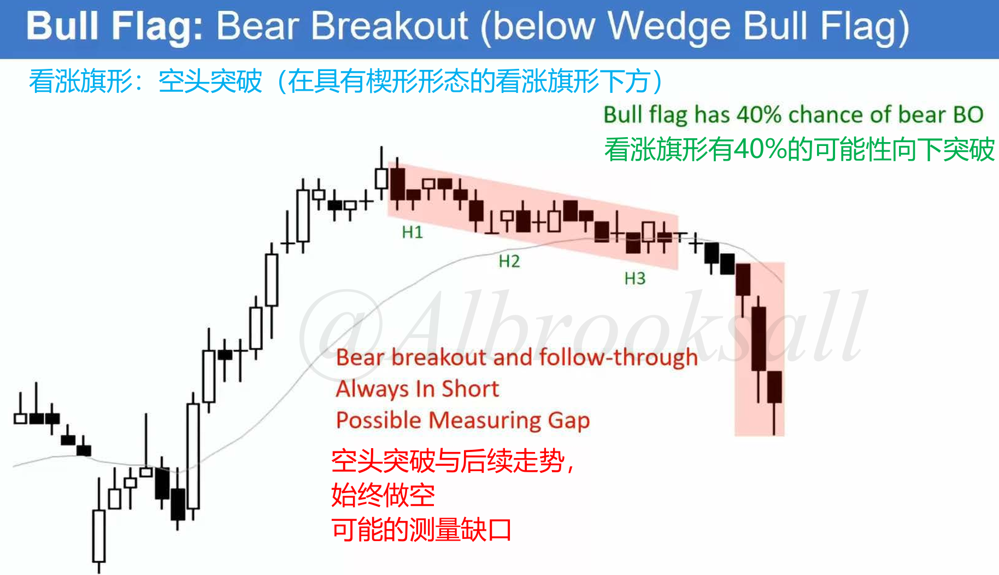
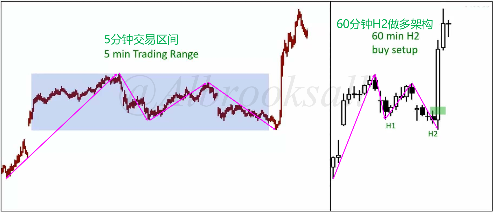
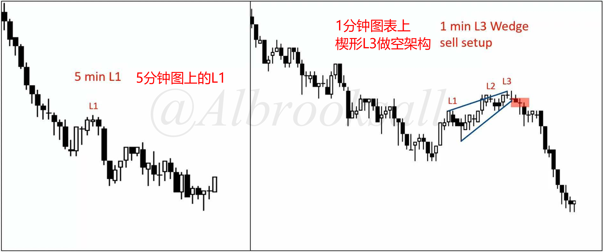
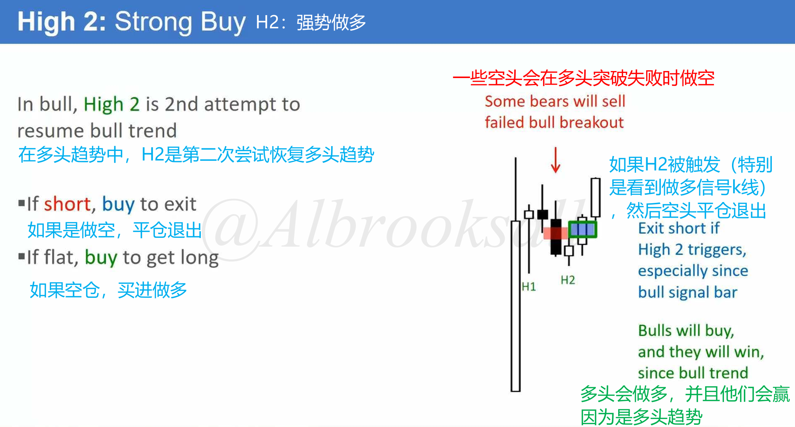
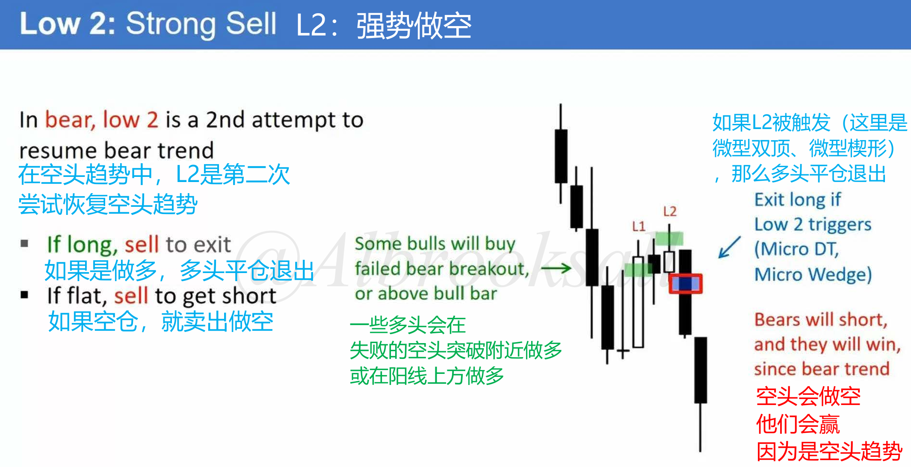
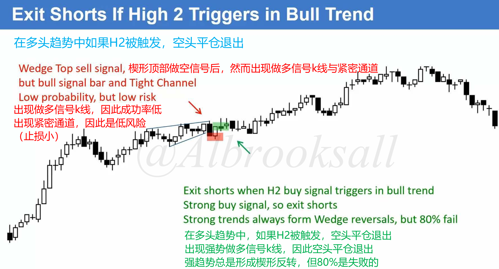

# 09C

## 无休止的回调

如果回调继续发展，可能会演变成相反的趋势。

如图所示，回调增长到20或更多K线，则是无休止的回调，多头突破的可能性降低到与空头突破大致相同。

> 看涨旗形有60%概率向上突破，40%概率向下突破。
>
> 看跌旗形有60%概率向下突破，40%概率向上突破。

最终空头突破，开启下跌趋势。

## 时间框架

### 高时间框架

在当前周期如果看不出来，可以切换到更大级别去观察，此时就很明显了。

### 低时间框架

在当前周期如果看不出来，也可以切换到更小级别去观察，此时就很明显了。

## 逆势交易者在H2或L2退出

### H2：强势做多

在上涨趋势，一些空头会在多头突破失败时做空。

H2是第二次尝试恢复多头趋势，做空就平仓退出，空仓就买入做多。

没人愿意做空，市场上涨以寻找买家，H2是多头趋势中可靠的做多信号。

### L2：强势做空

在下跌趋势，一些多头会在空头突破失败时做多。

L2是第二次尝试恢复空头趋势，做多就平仓退出，空仓就卖出做空。

没人愿意做多，市场下跌以寻找卖家，L2是空头趋势中可靠的做空信号。

### H2/L2成为高胜率入场点的原因

1. 双重力量推动：
   1. 顺势交易者入场：他们看到趋势恢复的第二次尝试，认为是高概率的入场点。
   2. 逆势交易者离场：他们的回补行为（买入或卖出）进一步推动价格朝趋势方向发展。
2. 供需失衡：在 H2 买点，多头和（离场的）空头都在买入，缺乏卖方；在 L2 卖点，空头和（离场的）多头都在卖出，缺乏买方。这导致价格更容易向趋势方向移动。

交易启示：识别趋势回调中H2/L2非常重要，将 H2/L2 作为可靠的顺势入场信号，尤其当信号K线形态良好时。如果进行逆势交易，务必在对自身不利的 H2/L2 信号触发时严格止损离场。

