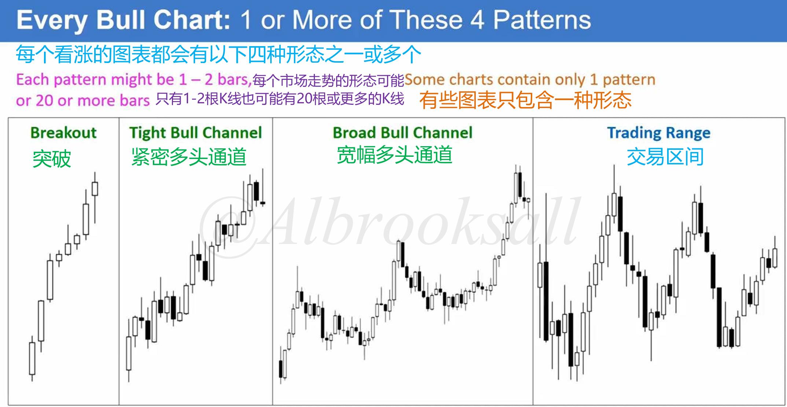
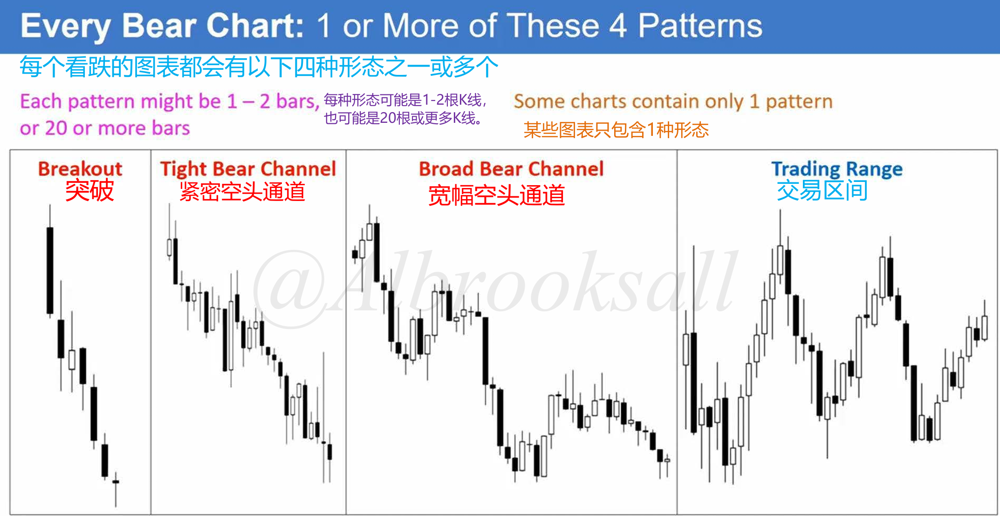
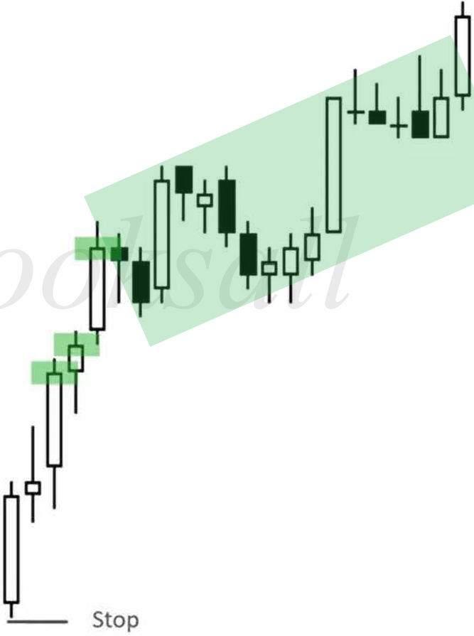
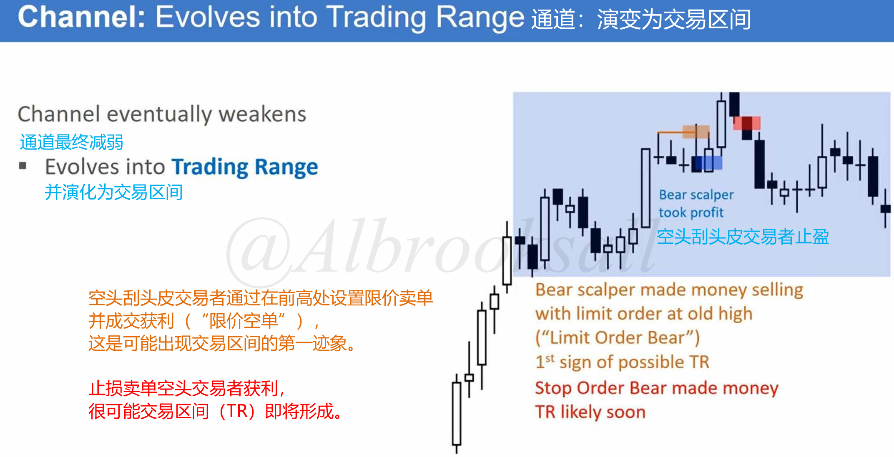

# 12A

## 市场周期的4种形态

| 市场周期 | 特征                                                         | 交易策略                                                     |
| -------- | ------------------------------------------------------------ | ------------------------------------------------------------ |
| 突破     | 由一系列强趋势K组成，实体大； K线之间重叠很少，几乎没有回调； | 方向唯一：顺突破方向交易，严禁逆势操作 交易方式：波段交易 |
| 窄通道   | 趋势方向明确，但开始出现回调； 回调通常短暂（1~3根K线）且幅度浅； | 方向唯一：顺突破方向交易，严禁逆势操作 交易方式：波段交易 |
| 宽通道   | 趋势方向明确，出现回调； 回调深入且持久（5~20根K线）； 逆势交易者开始有机会通过剥头皮盈利； | 双向机会：顺势逆势均可操作 顺势交易：上涨宽通道回调买入或下跌宽通道反弹卖出 逆势交易：剥头皮交易，上轨卖出下轨买入 |
| 交易区间 | 市场失去明确方向，主要进行横向运动； 通常指持续20根K线以上的盘整； 80%的突破尝试会失败； | 双向机会：顺势逆势均可操作 操作方式：高抛低吸，区间上三分之一卖出，下三分之一买入，以剥头皮为主，赚取小额利润。 |

## 市场状态演变

### 处于永无止境的循环中

市场状态通常遵循 **突破 --> 通道 --> 震荡区间 --> 新的突破** 的循环。

### 趋势始于突破

突破是趋势的开端，是趋势中最强劲的部分，一旦出现回调，则突破阶段结束。

### 回调是通道的开始

回调是通道的开始，**一旦出现回调，则意味着趋势的突破阶段已经结束，通道阶段开始了**。

### 通道演变为交易区间

通道最终减弱并演变为交易区间。

在上涨通道中，空头剥头皮交易者通过在前高设置限价卖单并成交获利，这是出现交易区间的第一迹象。

在下跌通道中，多头剥头皮交易者通过在前低设置限价卖单并成交获利，这是出现交易区间的第一迹象。

