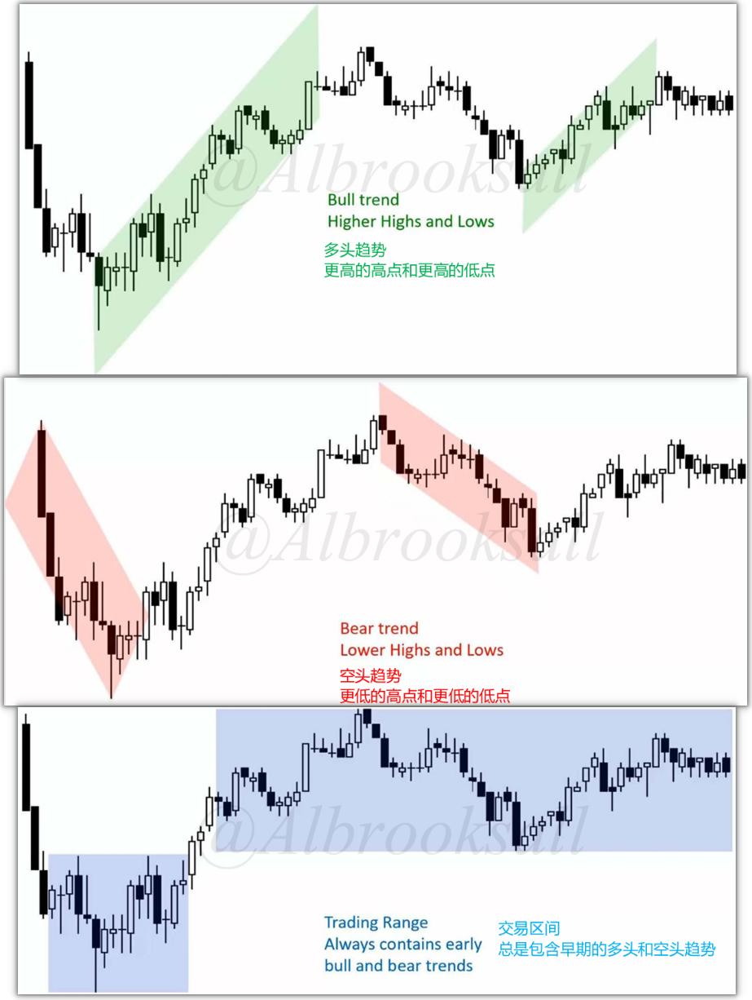
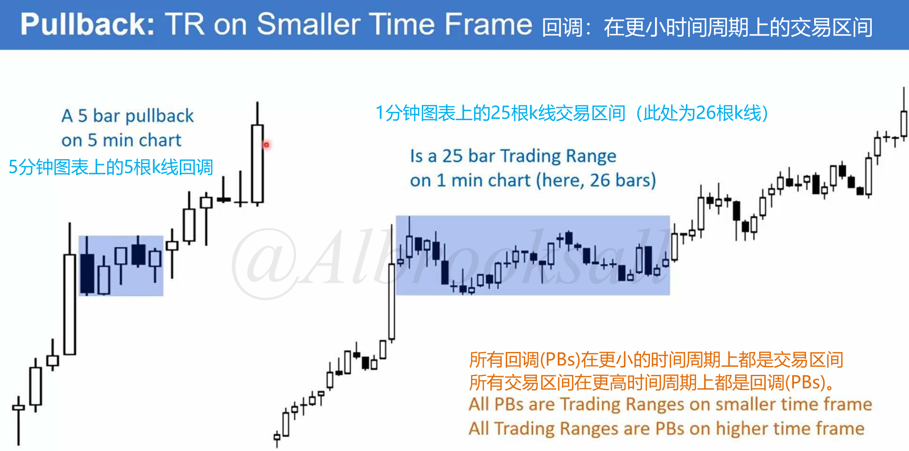
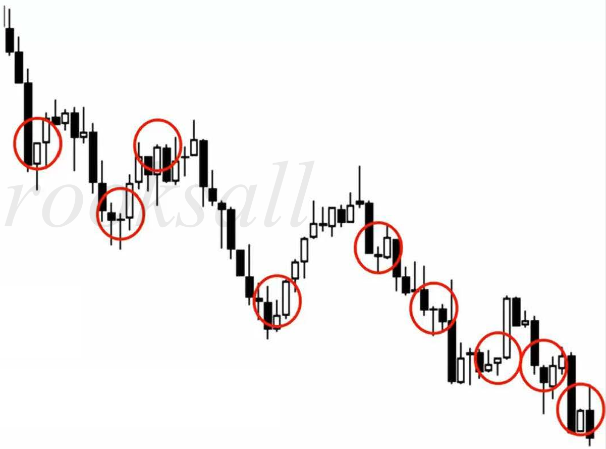

# 12B

## 市场总处于趋势或交易区间内

### 市场周期的不同划分

同样的走势，可以有不同的划分方式。

### 小型交易区间作为回调

当交易区间较小且在趋势开始位置，称为回调，它是趋势中的暂停。回调后趋势通常会延续。

因为回调在更小时间周期上视为交易区间，交易区间在更高时间周期上视为回调。

## 惯性和80%法则

市场倾向于延续先前的行为。

在趋势中，会持续展现出试图反转的行为，然而80%反转尝试大多未能成功。

在交易区间中，不断尝试突破，80%突破会失败。

## 趋势、波段、走势段的定义

