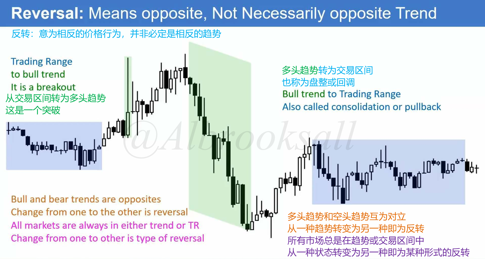
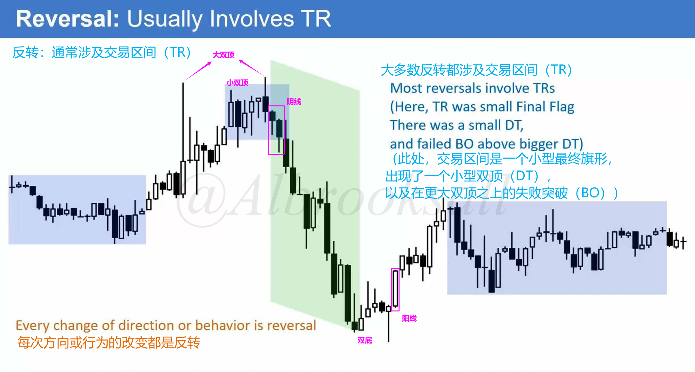

# 21A

## 反转的定义

### 反转的广义定义

广义定义：从一种市场行为类型转变位另一种即为反转。比如强趋势转换为震荡，这就是反转，尽管大多人不这么认为。

- 交易区间-->多头趋势：多头突破。
- 多头趋势-->交易区间：多头趋势转换为交易区间，也称为盘整或回调，开始是回调，但一旦回调K线增加到20根甚至更多，多头突破的几率就会下降到与空头突破几率相同。不称其为回调，而是使用交易区间一词。**在开始回调的初期，趋势回复的概率较大，但随着K线图增加，多头空头概率会趋于相等**。

### 反转通常进入交易区间（TR）

大多数反转都涉及某种交易区间，通常情况下，**趋势不是直接转变为反向趋势，而是短暂进入一个交易区间**。

## 主要和次要反转

### 次要反转

特征：通常只持续较短的时间，例如3到10根K线。**它不会导致原趋势彻底转变为一个方向相反的新趋势**。

常见结果：

- 演变成原趋势的持续旗形。例如，在下降趋势中出现的小幅反弹，往往会形成一个熊旗，随后价格继续下跌。
- 演变成交易区间。
