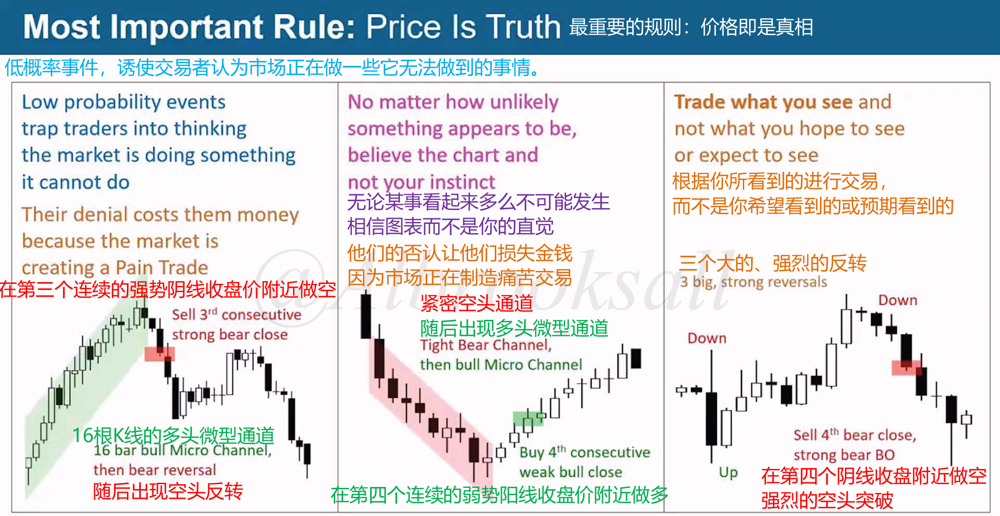
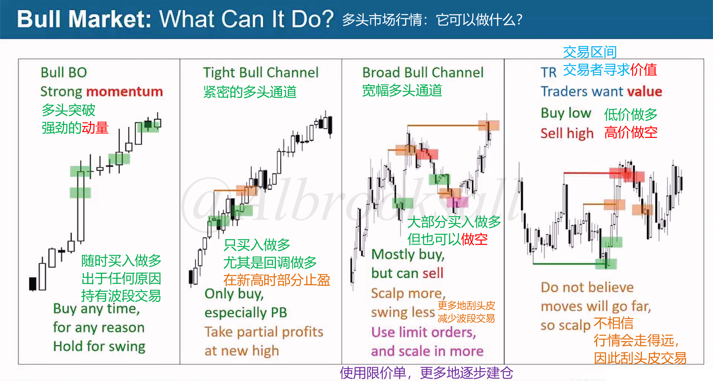
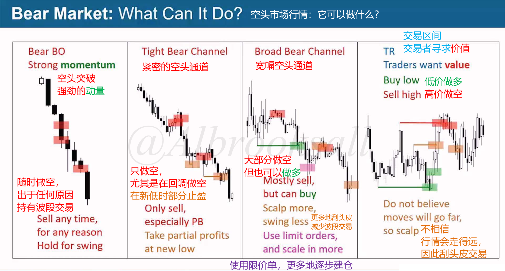
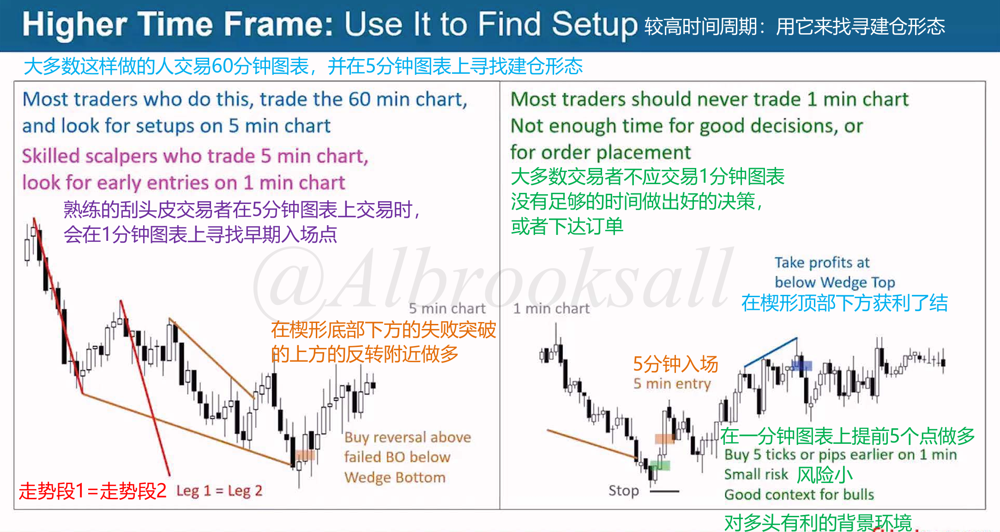
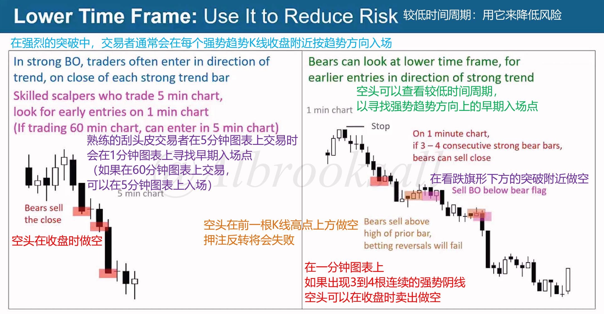

# 37A

## 价格就是真理

某些时候会出现一些低概率事件，这时候就不要再纠结概率本身，而是跟随市场价格。

下面三张图就是发生的低概率事件：

- 图一：连续的窄通道上涨却出现强势阴线
- 图二：连续的窄通道下跌却出现强势阳线
- 图三：价格强势突破前高却又出现连续阴线

市场发生了低概率事件，此时要相信市场本身。

## 跟随市场操作

牛市：

- 突破：出于任何原因随时买入做多，持仓波段交易
- 多头窄通道：只回调做多
- 多头宽通道：
  - 大部分情况做多，也可以做空
  - 减少波段交易，多采用剥头皮
  - 使用限价单，并逐步加仓
- 交易区间：
  - 低价做多，高价做空
  - 不相信行情会走得远，剥头皮交易

熊市：

- 突破：出于任何原因随时买入做空，持仓波段交易
- 空头窄通道：只回调做多做空
- 空头宽通道：
  - 大部分情况做空，也可以做做
  - 减少波段交易，多采用剥头皮
  - 使用限价单，并逐步加仓
- 交易区间：
  - 低价做多，高价做空
  - 不相信行情会走得远，剥头皮交易

## 构建交易的原则

1.赚钱的关键在于知道如何构建一笔交易

决定是做多还是做空。止损放哪里？利润目标是多少？

2.只有10%的K线处于强势突破中，当出现强势突破时，只能顺势交易。对于其余90%的K线，有可能构建盈利的做多交易和盈利的做空交易。

3.交易者的规则

- **先追求不要亏钱**
- **再追求赚钱**
- **最不重要的是赚大钱**

## 多时间框架

较高时间周期寻找建仓形态，较低时间周期用来降低风险。

