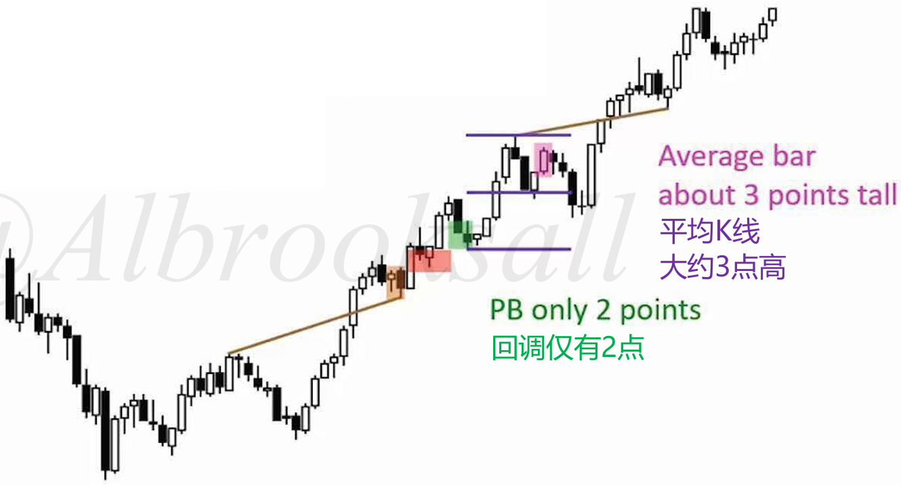
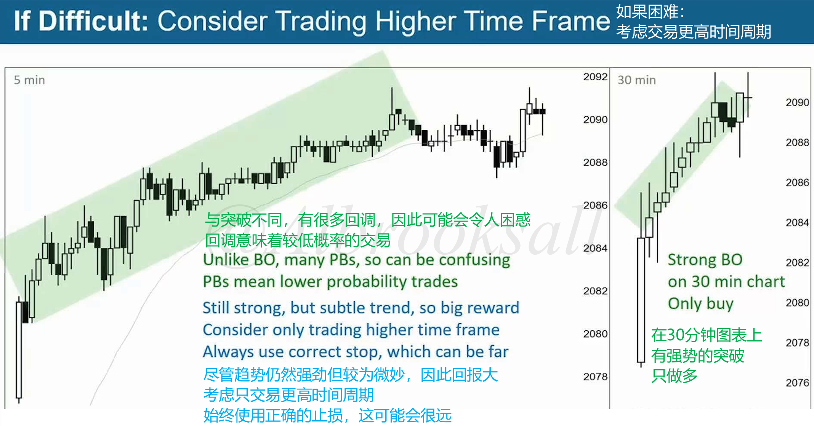
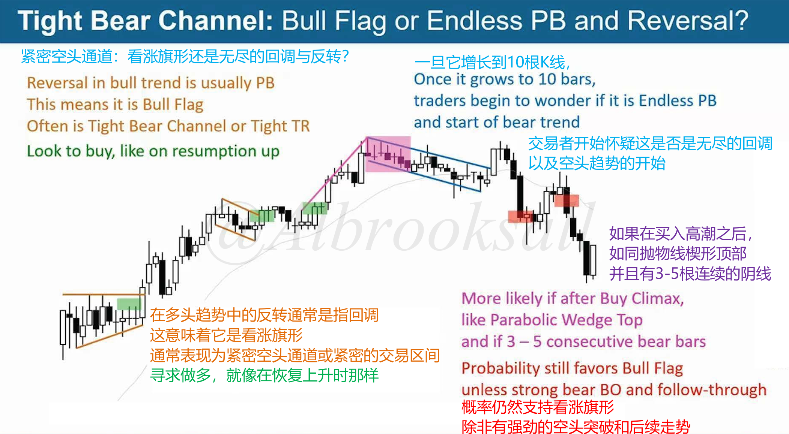

# 43A

## 多头窄通道

窄通道和宽通道的区别仅在于交易者会以不同方式进行交易。

当多头通道宽松时，可以进行做多或做空操作。当多头通道紧密时，很难通过做空获利，大多数回调都不会跌太深。只买入做多有更高概率和更高盈亏比。

窄通道特征：

- 回调大多持续1~3根K线
- 回调K线大小小于平均K线大小的2倍

## 较高时间周期是突破

窄通道在更高时间周期是突破。

## 空头窄通道作为牛旗

在多头趋势中反转通常是指回调，意味着是牛旗，通常表现为空头窄通道或紧密的交易区间，寻求做多。

