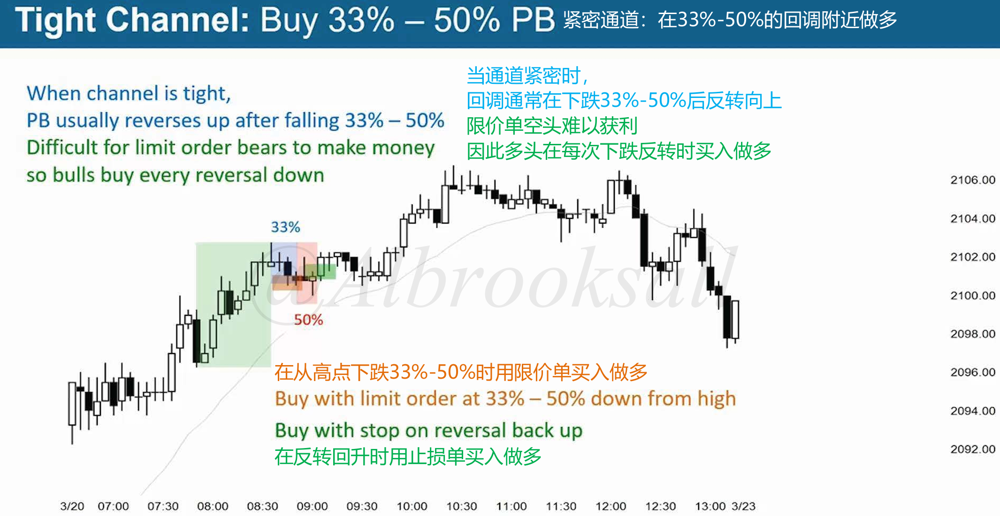
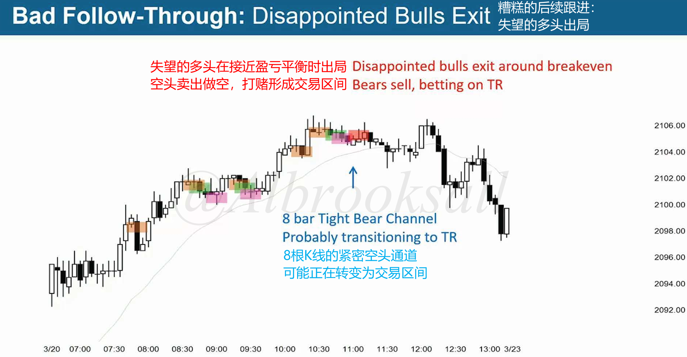
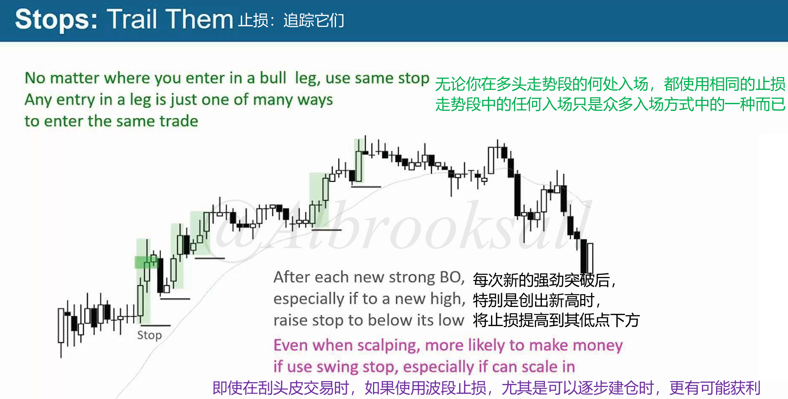
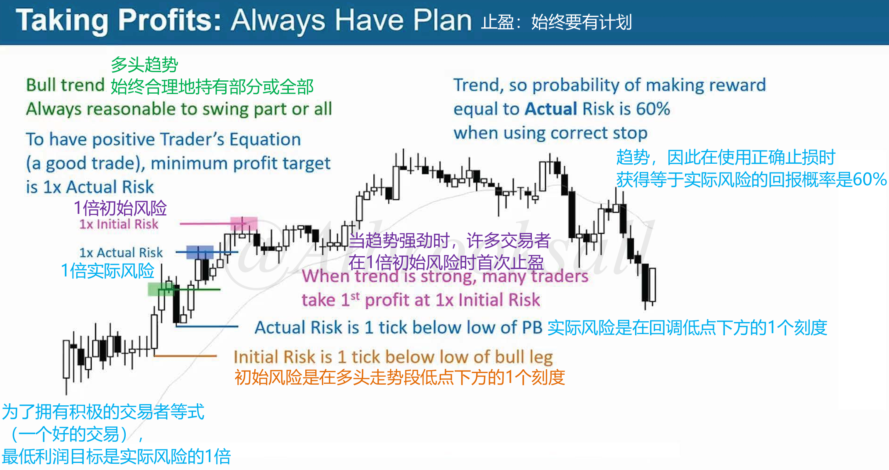
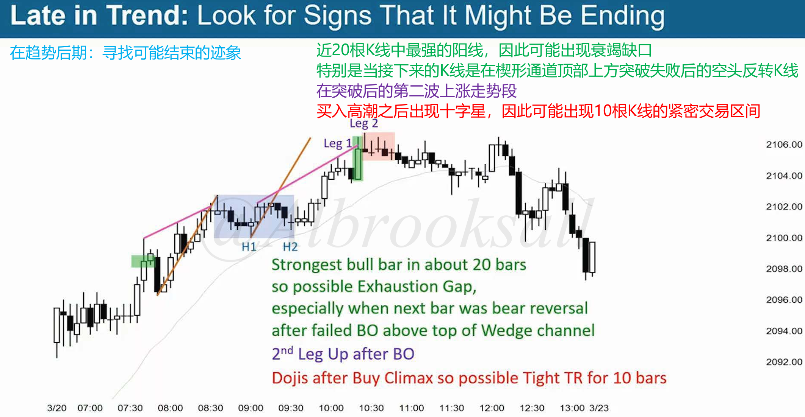
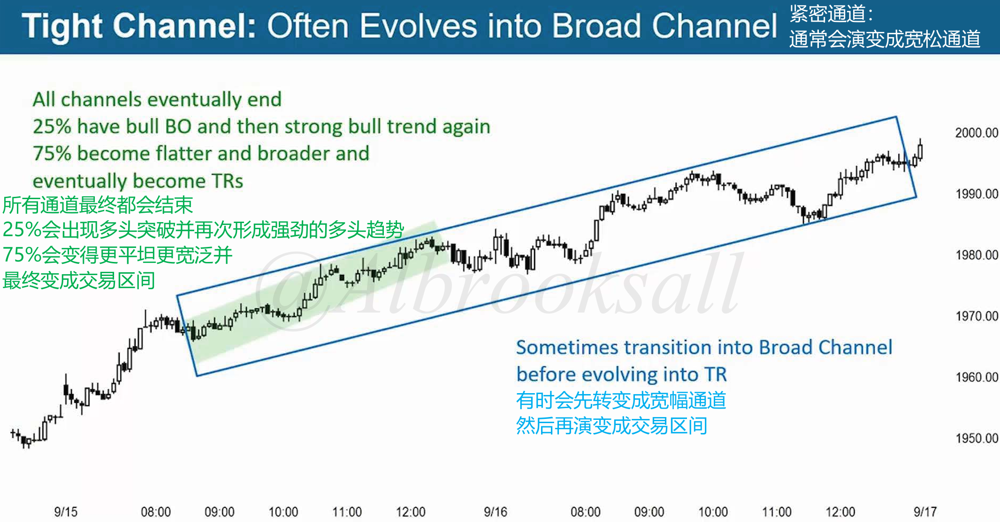

# 43D

## 窄通道做多

**在回调时候做多而非突破时买入做多，回调33%~50%位置买入做多最佳**。

- 从高点下跌33%~50%时候用限价单买入做多
- 反转回升时候用止损段买入做多

当通道紧密时，多头通常在1~3根K的回调后恢复上涨。

当回调出现较多K线时（10根以上），此时要考虑可能转变为交易区间，要尽量平局出场。

## 止损和止盈

### 止损

每次强势突破后，特别是创出新高时，将止损提高到其低点下方。

### 止盈

## 窄通道演变

### 演变成交易区间

### 演变成宽通道

