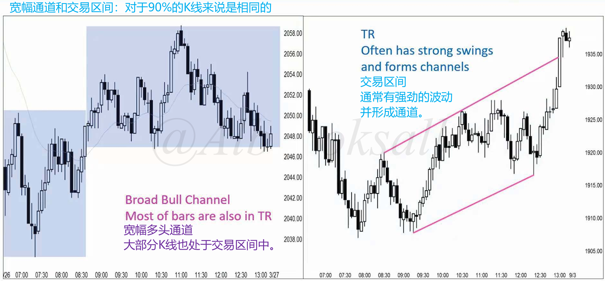
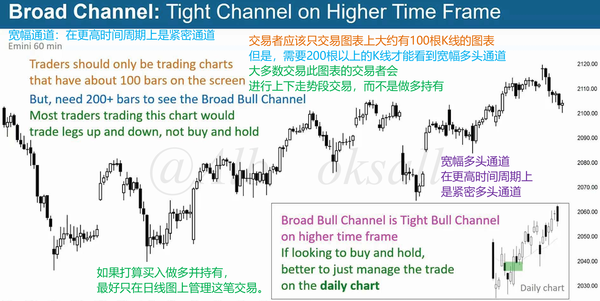
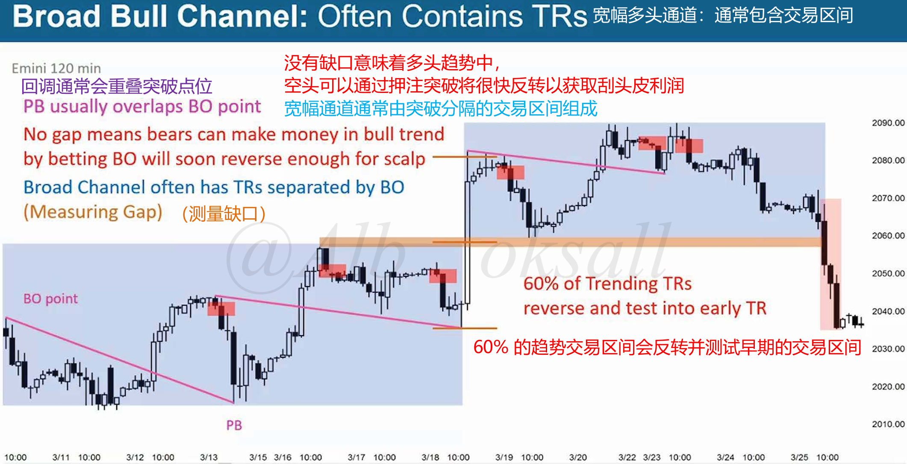
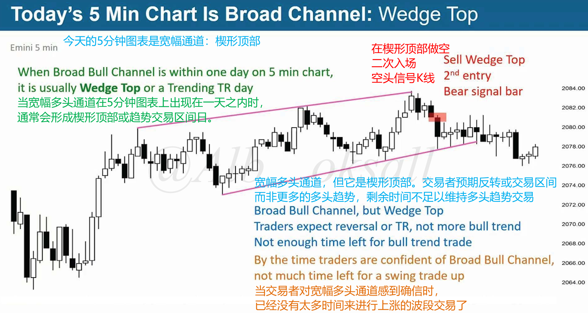

# 45A

## 多头宽通道

### 宽通道和交易区间90%K线相同

可以看到同一张图表，根据不同视角去划分，可以是宽通道，也能是交易区间。

### 宽通道在更高时间周期是窄通道

## 通常包含交易区间

### 宽通道由交易区间分割而成

宽幅通道通常由突破分割的交易区间组成。

### 楔形顶

多头宽通道在某些时候可作为楔形顶，交易者预期反转或交易区间，而非多头趋势。

