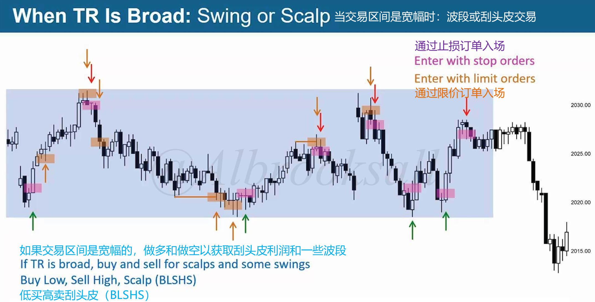
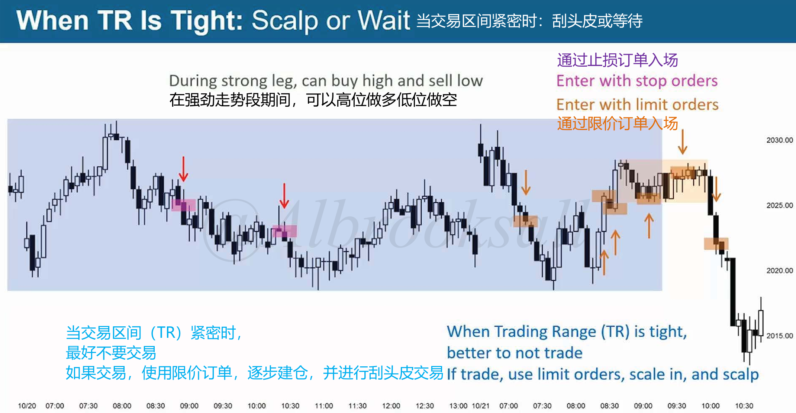
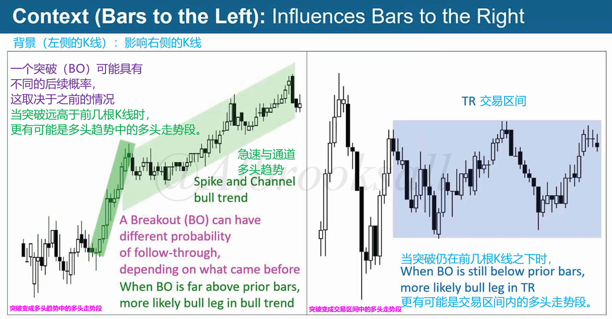
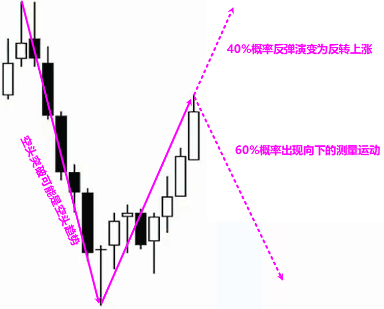
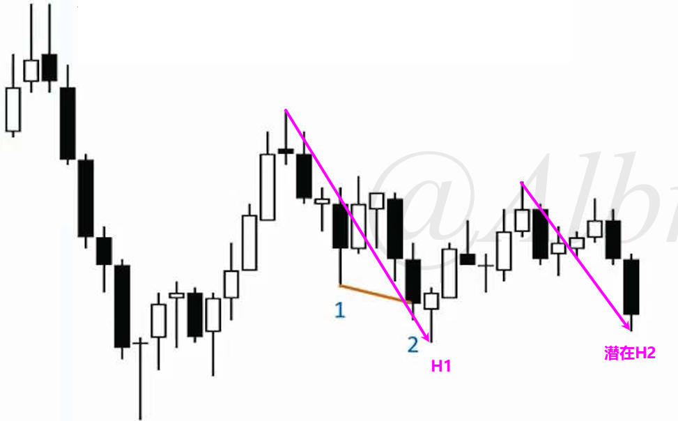
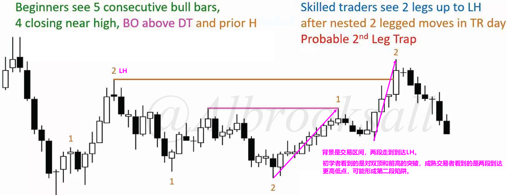
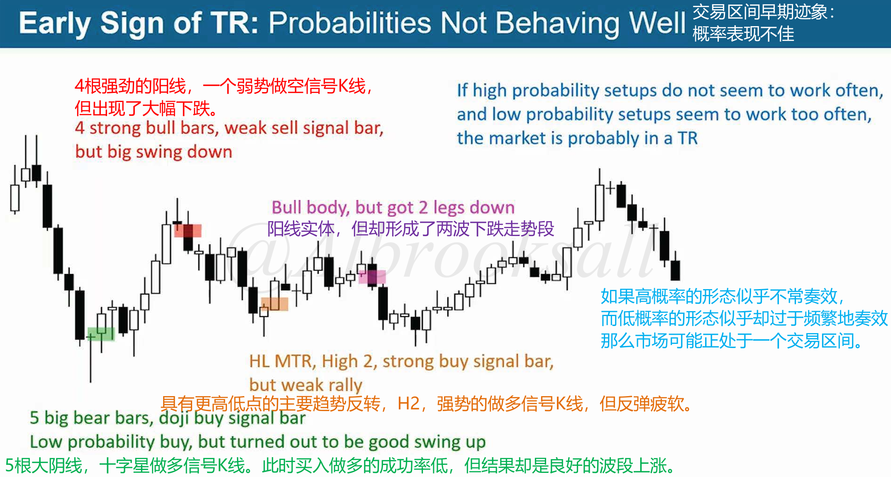
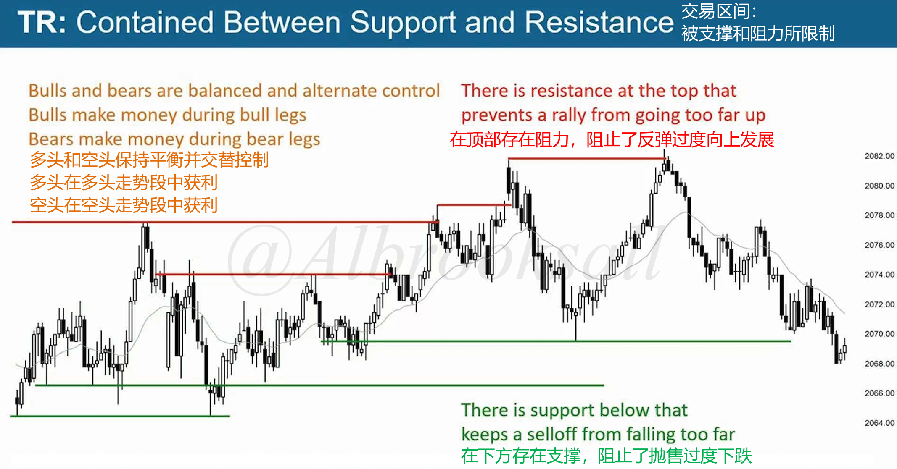

# 47A

## 交易区间（TR）是宽幅还是紧密？

当交易区间是宽幅时候，通过剥头皮利润和一些波段做多做空，低买高卖剥头皮。

通过止损单（Stop Order）或限价单（Limit Order）入场。

当交易区间是窄幅时候，最好不要交易。如果要交易，使用限价单逐步建仓，并进行剥头皮交易。

## 寻找交易区间的迹象

### 左侧K线背景

突破具有不同的概率：

- 当突破远高于前几根K线时，更有可能是**多头趋势中的多头走势段**
- 当突破仍在前几根K线内时，更有可能是**交易区间内的多头走势段**

### 概率表现不佳

1.强势的空头突破可能是空头趋势，第一次反弹可能被做空以测试回落。60%可能会出现向下的测量移动，以及40%的可能反转上涨。

2.初学者看到连续阴线收盘接近低位，可能出现测量缺口。

熟练交易者会认为两波下跌走势段可能出现H2做多架构和更高低点，认为交易区间很可能形成。

3.初学者看到5根连续阳线且4根收盘近高位，突破在双顶和前高上方。

在交易区间内看到嵌套的两波走势段到达更低的高点，可能是第二次上涨陷阱。

---

高概率形态似乎不常奏效，低概率形态形态却似乎过于频繁奏效，那么市场可能正处于一个交易区间中。

### 被支撑和阻力限制

下图是上面图的更小周期。

