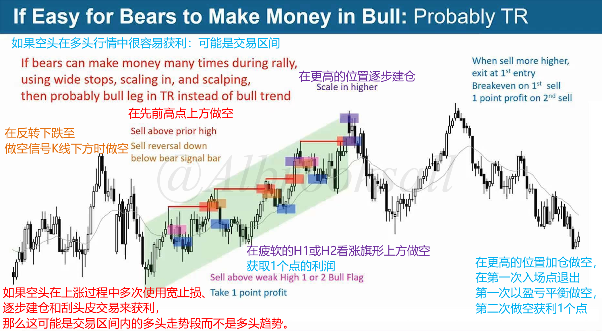
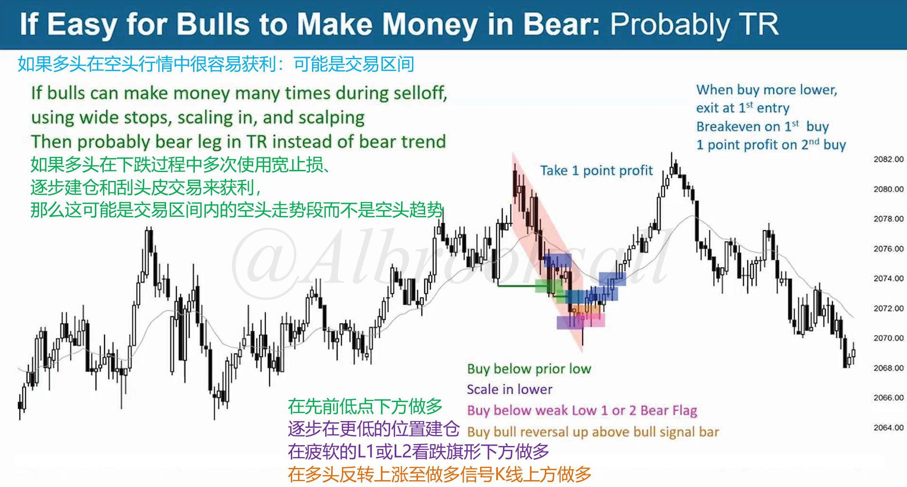
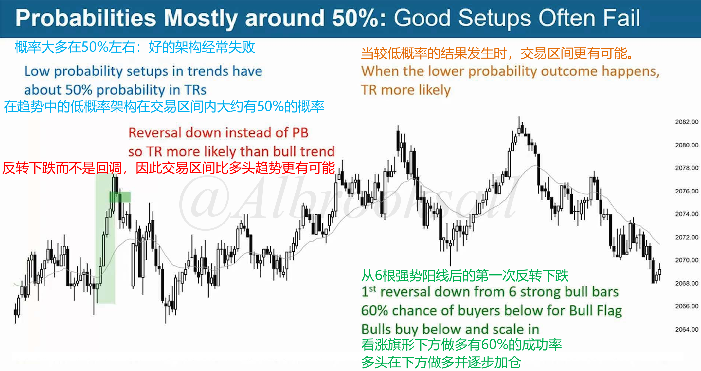
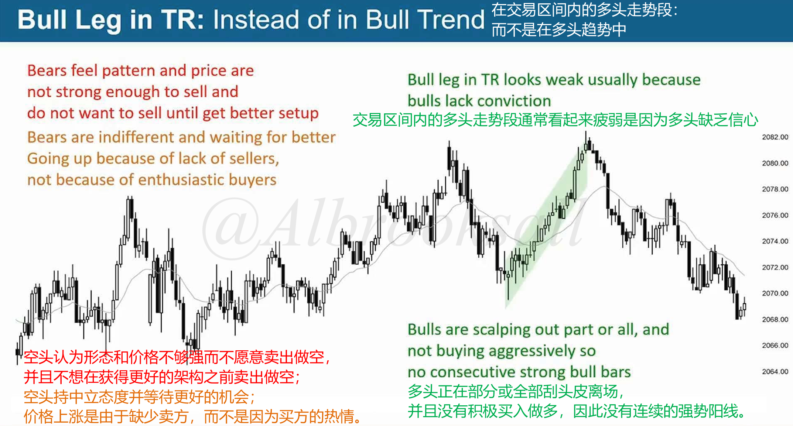
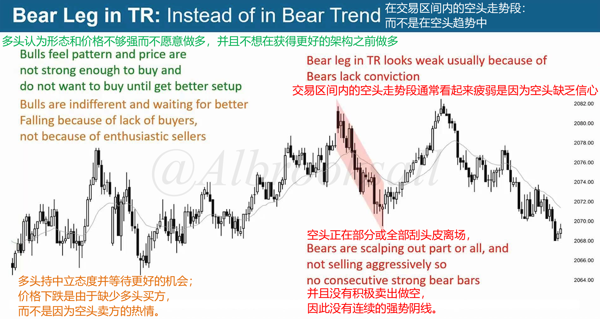
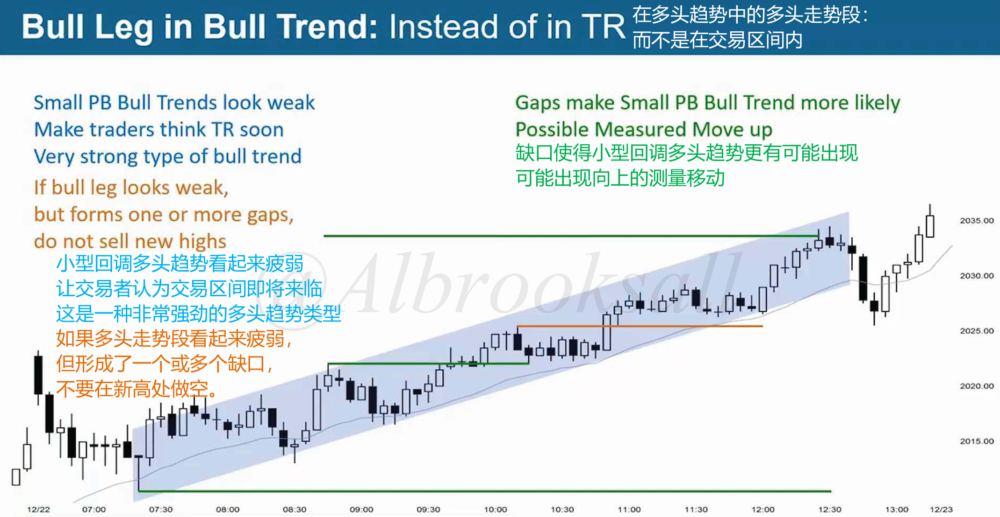
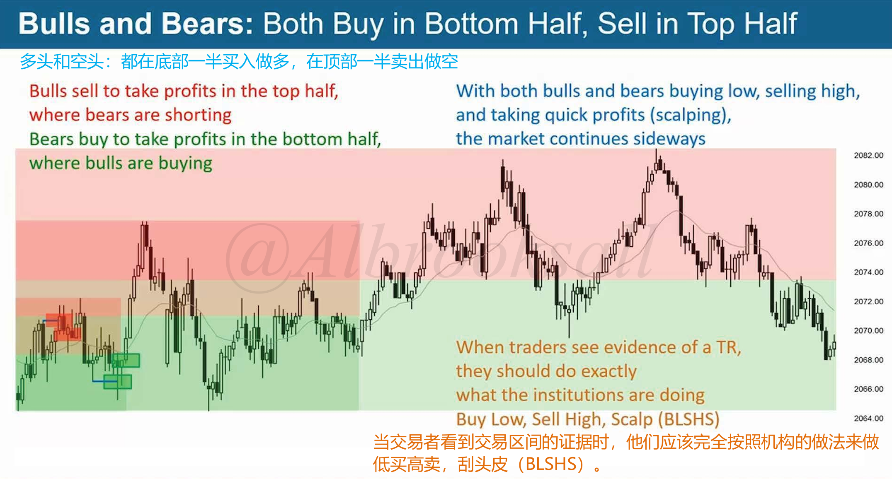
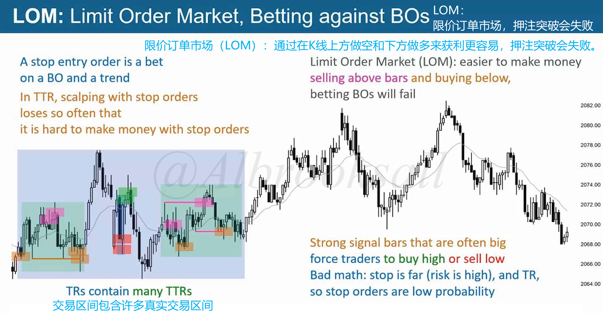

# 47B

## 80%规则

### 80%会突破失败

**市场具有惯性，它们抗拒变化并倾向于延续之前的走势。在交易区间内，80%的向上和向下突破都会失败。**

如果空头在多头行情中很容易获利，多头在空头行情中很容易获利，可能是交易区间。

### 好的架构经常失败，坏的架构往往有效

## 走势段的环境

### 交易区间的走势段

1.交易区间内的多头走势段

空头持中立态度并等待更好机会，价格上涨是由于缺少卖方，而不是因为多头买方热情。

交易区间内的多头走势段通常看起来疲弱，是因为多头缺乏信心。多头剥头皮离场，并未积极买入做多，因此没有连续强势阳线。

2.交易区间内的空头走势段

多头持中立态度并等待更好机会，价格下跌是由于缺少买方，而不是因为空头卖方热情。

交易区间内的空头走势段通常看起来疲弱，是因为空头缺乏信心。空头剥头皮离场，并未积极卖出做空，因此没有连续强势阴线。

### 趋势的走势段

1.多头趋势中的多头走势段

小型回调多头趋势看起来疲弱，让交易者认为交易区间即将来临。如果多头走势段看起来疲弱，但形成一个或多个缺口，不要在新高处做空。

缺口使得小型回调多头趋势更有可能出现向上的测量运动。

2.空头趋势中的空头走势段

小型回调空头趋势看起来疲弱，让交易者认为交易区间即将来临。如果空头走势段看起来疲弱，但形成一个或多个缺口，不要在新低处做多。

缺口使得小型回调空头趋势更有可能出现向下的测量运动。

## 开仓的区域

在顶部一半买入做多，在顶部一半卖出做空。

## 限价单市场

在交易区间做剥头皮，用止损单（Stop Order）交易常常导致亏损，因此要使用限价单（Limit Order）。

交易区间的强势信号K通常很大，最终就会造成止损距离太远，因此交易区间内的止损单成功率较低。

