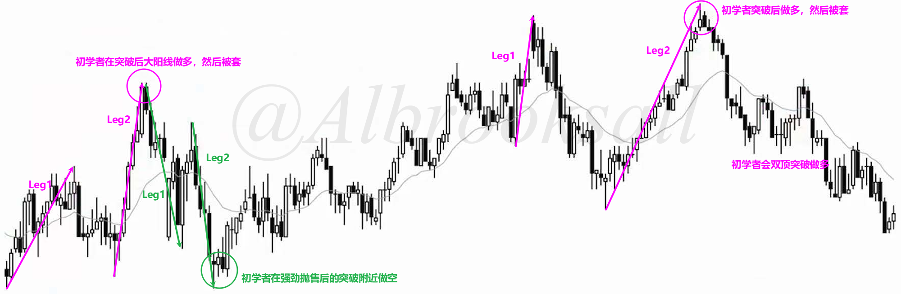
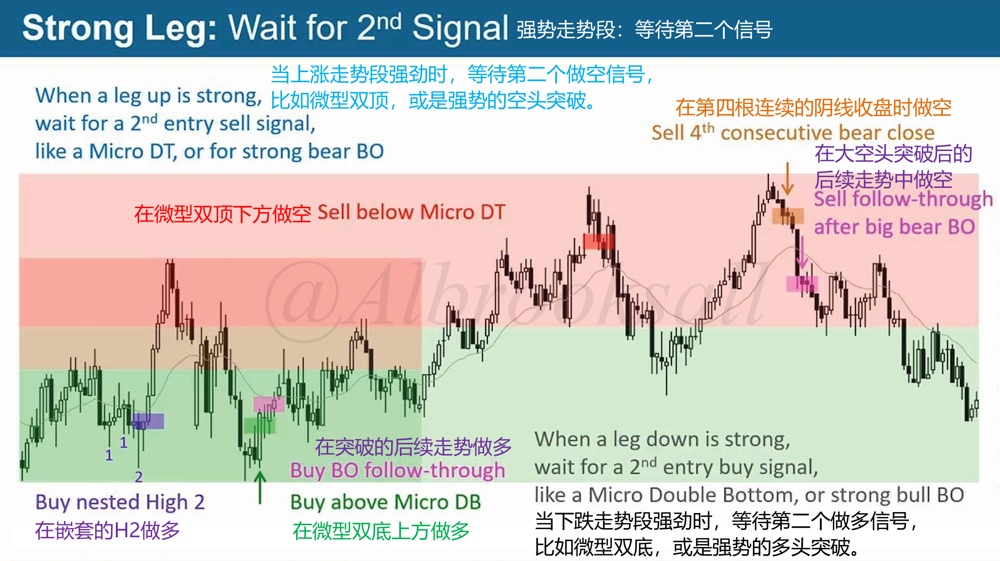
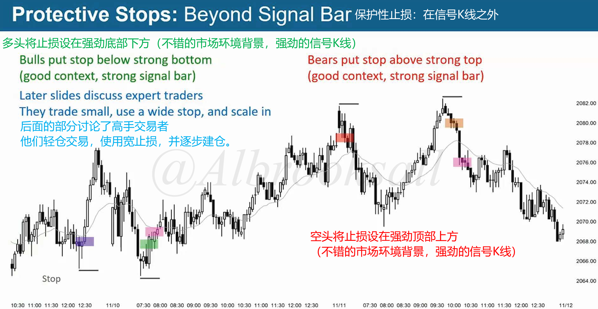

# 47C

## 第二段陷阱

初学者在高位做多低位做空时被套。

高手会淡化突破，押注于被套的交易者。

## 反转时入场

时机选择可能很困难，顶部做空时候不确定是否是最终顶部，底部做多时候不确定是否是最终底部。

区域选择则是上半部分做空，下半部分做多。

走势段较强劲时候，等待第二个信号，比如微型双顶/双底，或者强势突破。

## 止损设置

止损设置：在强劲信号K外。

> 初学者不应该使用宽止损和逐步减仓，如果被止损出局，可以在第二次反转时再次入场。

