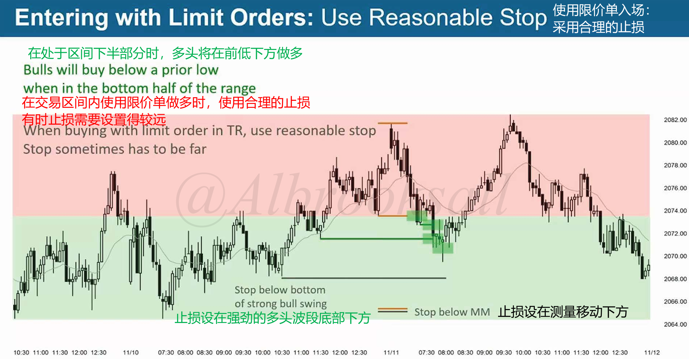
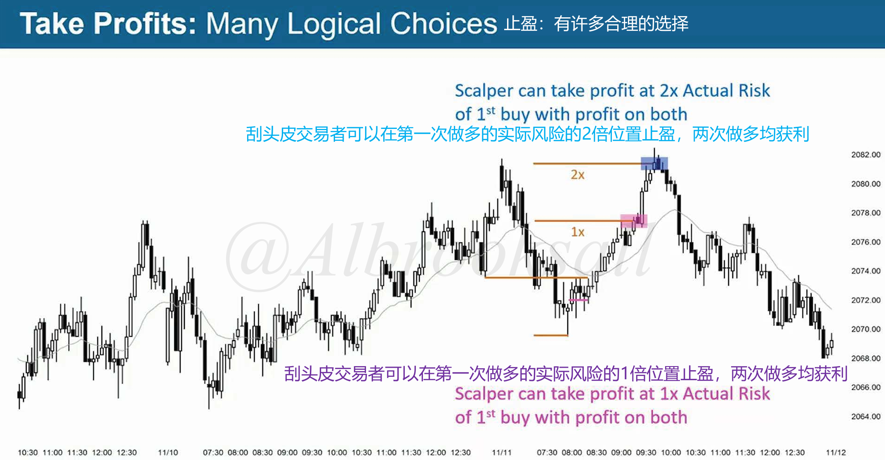
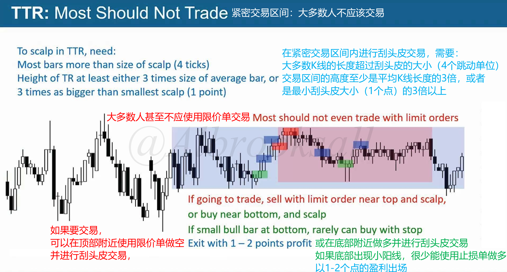
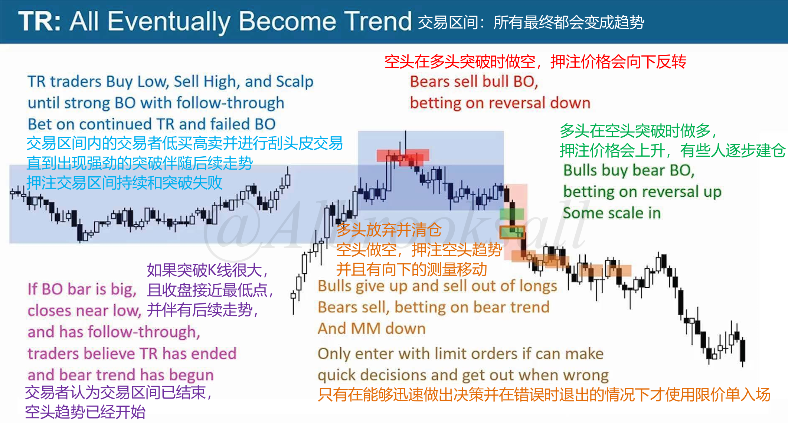

# 47D

## 使用限价单入场

使用限价单入场，并采用合理止损。

## 止盈

剥头皮交易讲究的是快进快出，交易区间空间不大，所以有一定利润就可以主动离场。

### 1~2倍风险位置

在风险位置的1~2倍风险位置止盈。

## 紧密交易区间（TTR）

紧密交易区间内，空间范围很小，不建议操作。如果非要操作那也必须用**限价单+剥头皮**操作。

## 交易区间最终都会变成趋势

一旦演变成趋势，交易思路就要发生转变。

