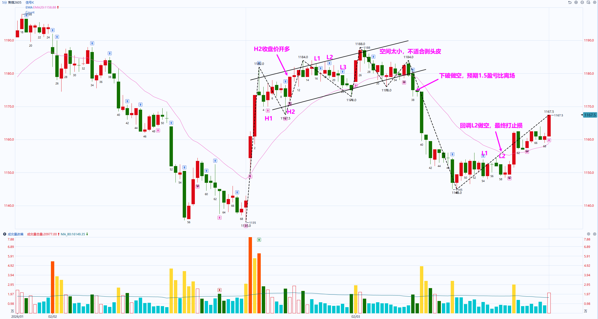
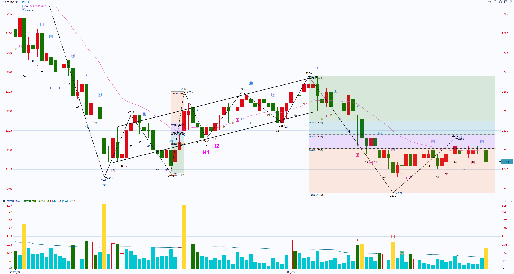
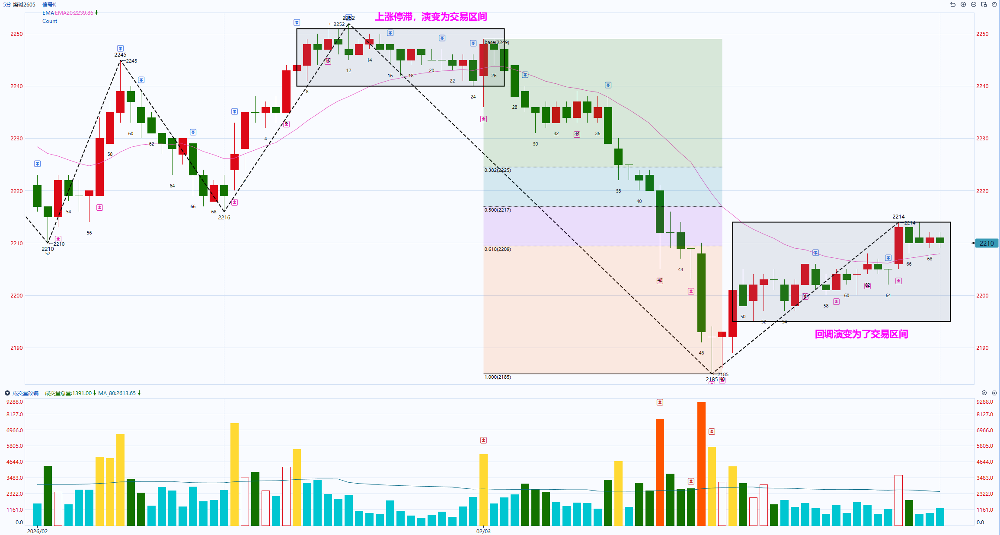
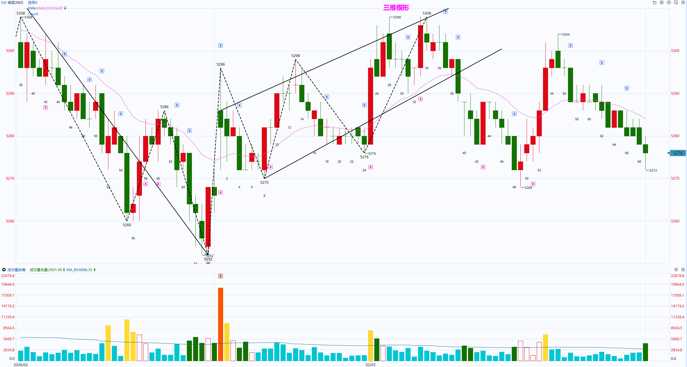

# 2026/02/03 行情复盘

## 焦煤2605

行情分析：

- K1~K3：价格在开盘后向上突破，在K3受到压力并开始回调。

- K3~K10：上涨突破的回调，出现H2，因此也尝试了开多。
- K10~K21：上涨受阻，为次级别震荡，依旧持仓。
- K22：价格下破小震荡区间，于是平多，并反手开空。
- K25~K28：价格上涨并受阻，此时应该意识到形成了宽通道，该宽通道斜率较小，偏向于震荡，由于区间空间不大，所以后续没有操作。到达K28出现三推楔形，此时应尝试开空。
- K38~K39：价格下破宽通道下轨，此时应开空，剥头皮操作，盈利目标能有1.5盈亏比即可。
- K39~K47：窄通道下跌，只做空。
- K48~K60：会认为是下跌趋势的回调部分，如果空仓会在L2尝试空单，当然最终会止损。
- K61~K69：价格向上突破次级别震荡区间，并持续走强，当前为窄通道上涨，以做多为主。

操作分析：

- K10收盘开多：符合上涨趋势回调后的操作，H2开多，符合交易系统。
- K22收盘反手开空：平多操作没有问题，因为出现L2。但看空有问题，因为价格在K22收盘时候还看不出有转为下跌趋势的迹象，属于感觉交易。

机会分析：

- K10回调H2开多；K22平多
- K28出现三推楔形开空；2倍盈亏比平空
- K39突破开空；1.5倍盈亏比平空
- K58回调L2开空；K61空单止损

## 甲醇2605

行情分析：

- K1~K2：突破上涨但受到阻力，开始回调
- K3~K8：上涨的回调，到达50%位置，出现H2开多
- K9~K16：价格上涨乏力，此时意识到形成宽通道上涨，且在K16构成三推楔形，因此可尝试开空。
- K17~K23：价格小幅下跌到达通道下轨，但随后止跌，说明通道运动还未结束。K23完成对K22包含。
- K23~K30：价格小幅上涨到达通道上轨，此时构成楔形的第4推，所以在K31收盘做空。
- K31~K50：窄通道下跌。
- K51~K69：下跌趋势的回调，但超过20根，所以很有可能演变为震荡区间。

操作分析：

- K34：开仓时候认为当前位置是震荡区间，是错误的，应该是上涨宽通道，只是斜率较小，偏向于震荡。

机会分析：

- K6回调开多；K16平多止盈
- K16出现三推楔形反手开空；K23空单止损
- K30出现楔形第4推，开空；K55发现回调扩大，窄通道演变成宽通道，止盈离场。

## 烧碱2605

行情分析：

- K1~K14：上涨突破，此时随时可做多
- K14~K26：行情转为震荡
- K28：完成对震荡区间下破，且后续跟随始终没有回到震荡区间中，那么此时应以做空时间操作，因为突破方向是向下的。
- K30~K36：价格处于次级别震荡状态
- K37~K48：价格对次级别震荡区间完成下破，之后开启下跌突破行情
- K49~K69：开始进入回调，由于回调K线超过20根，说明很有可能演变为震荡。如果夜盘仍旧维持该价格附近，那么就按震荡操作。

机会分析：

- K2上涨突破直接开多；K16价格上涨停滞平多
- K29下破震荡区间开空；K49出现大阳线止盈
- K58会认为是回调的L2开空；K62空单止损

## 纸浆2605

行情分析：

- K1~K7：高开但开始回调
- K8~K13：小幅上涨
- K14~K24：小幅下跌，此时应该意识到行情转为震荡。从高低点位置看，整体是斜率较小的上涨宽通道。
- K25~K28：通道内上涨，K28出现滞涨，且后续跟随一般可尝试空单。
- K29~K37：在通道上轨受到压力下跌，但走的不远，K34出现较强上涨。然后K37出现开空信号，此时构成三推楔形。
- K37~K50：窄通道下跌，只做空。
- K51~K55：出现突破上涨，此时空单必须离场，只做多。
- K56~K59：出现突破下跌，K57收盘没有进入前面的上涨宽通道，所以是不错的开空信号。

机会分析：

- K28到达宽通道上轨且出现三推楔形开空；K33止损
- K37到达宽通道上轨且出现三推楔形第二次开空；K51出现三连阳平空
- K57下跌突破开空

