# 商品期货波段交易系统v8版

## 基础价格图形分析

### 分型和 K 线包含

顶分型：**无包含关系** 的 3 根 k 线，中间一根 k 线高点最高，低点也最高。

底分型：**无包含关系** 的 3 根 k 线，中间一根 k 线低点最低，高点也最低。

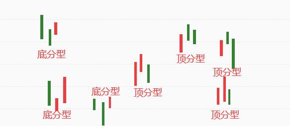

包含处理：将相邻的孕线组合处理成一根 K 线。

- 上涨趋势：遵循高高原则，即两个 K 线相互包含情况下，高点取两根 K 线最高点，低点也取两根 K 线最高点。
- 下跌趋势：遵循低低原则，即两个 K 线相互包含情况下，高点取两根 K 线最低点，低点也取两根 K 线最低点。

包含关系处理中趋势的定义：处理包含关系时候看 3 根 K 线，观察前 2 根是上涨还是下跌趋势。

> 无论是左包含还是右包含，处理方式都是相同的。

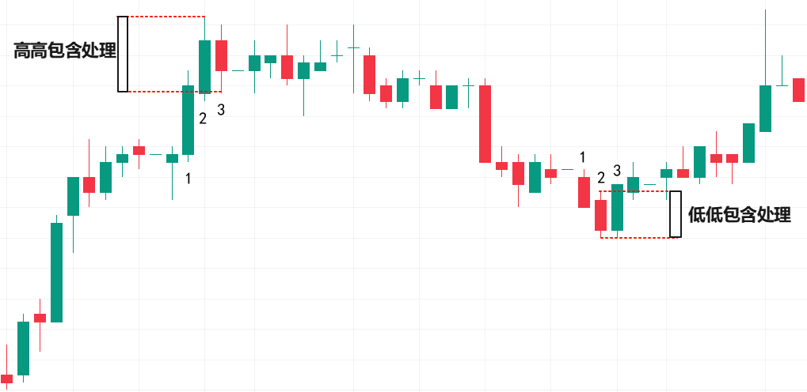

### 笔

#### 标准笔

标准笔定义：相邻顶底分型之间构成一笔。

连续的笔为一涨一跌轮流连接，因此处理完包含关系的分型也必须是一顶一底，至少有一根非公用 K 线。连续出现顶没出现底则取更高的，连续出现底没出现顶则取更低的。

下面四幅图笔画法如下：

A：`0~1` 不成笔，因此从 0 划到 3，3 再到 4。

B：本来可以 0 划到 1 的，但 `1~2` 间不成笔，因此 0 划到 3。

C：`0~1` 不成笔，`1~2` 看似成笔，但先画下跌趋势，因此 0 划到 3，3 再到 4。

D：注意蓝色的线是错误的，如果按照蓝色线，那么 `1~4` 之间有更低的底分型，因此画法是错误的，应该是 0 到 3，3 再到 4。

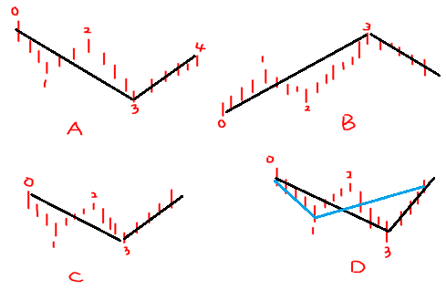

#### 特殊笔

1.缺口成笔

某段走势中，出现一个力度很大的缺口，可以认为当前的缺口是一笔。

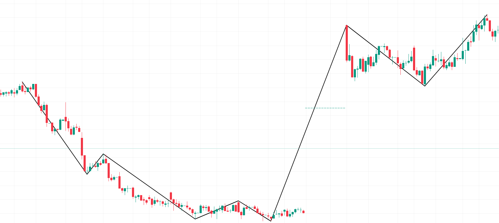

2.震荡区间内的笔

对于震荡较久的区间，可以不必按照标准笔来画，在一定程度上有点儿差距也是可以的，**目的是表示当前位置有震荡结构**。

### 线段终结划分

#### 最近的关键特征序列

特征序列为趋势内部的反向笔，但当走势运行一段时间后，只有最近的特征序列作用最大，趋势的转折是以最近的特征序列关键点判定的。

当为上涨趋势时候，最近的特征序列即为趋势最高点前的反向一笔；当为下跌趋势时候，最近的特征序列即为趋势最低点前的反向一笔。

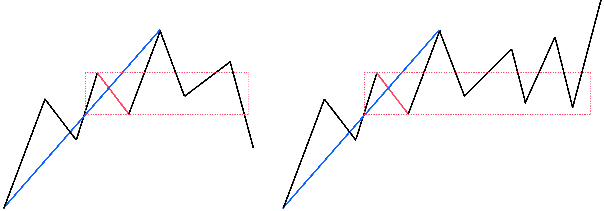

#### 根据特征序列划分线段

线段划分在于观察对最近特征序列的三种情况：不进入、进入、穿过。以穿过特征序列为标准确定趋势转折，即构筑新线段。

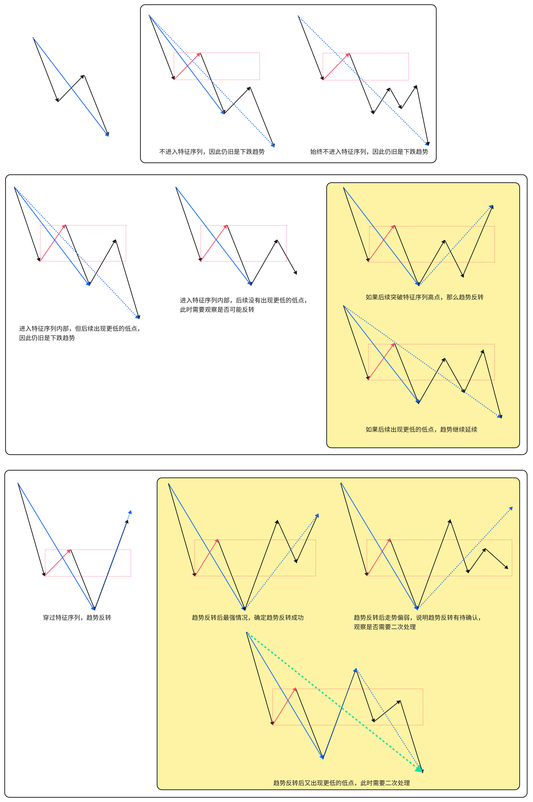

#### 均线判定终结

在一些比较复杂的情况，用结构划分线段会有问题，此时可以用均线进行判定。

如图是焦煤2605合约30分钟走势图，可以看到在标识位置，30F上涨段被突破特征序列下轨，此时从结构上任务30F上涨段结束，开启30F下跌段。但也可以通过均线判定，30F级别的MA5下穿MA20，认为构筑了新的30F下跌段。

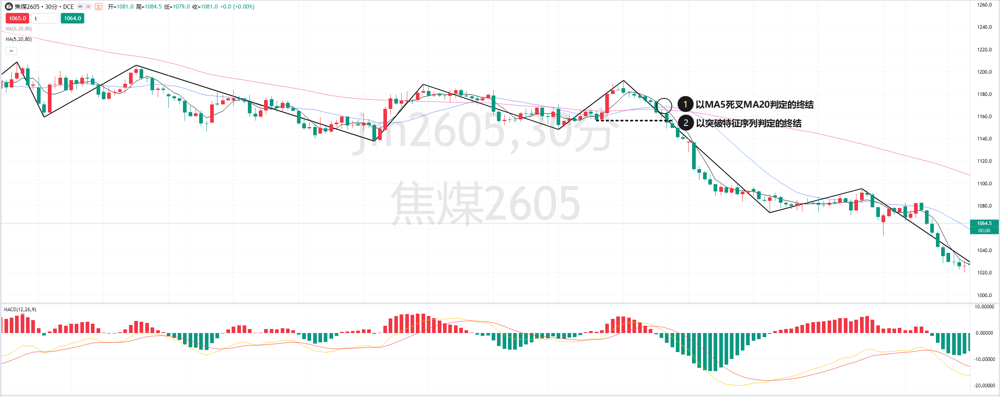

### 走势动能衰竭判定

#### 背驰

背驰思路来源于缠论，背驰意味着动能衰竭，但在实际中，背驰很多时候并不能保证趋势反转，背驰造成反转的概率不超过三成，以背驰作为反转交易的依据会被不断打止损，这是种成功率非常低的判定。头肩顶/头肩底比背驰的衰竭程度更厉害，哪怕是头肩顶/头肩顶这种价格不创新高或新低，都不能保证趋势一定反转，何况背驰判定了。综合来说，==**背驰判定从马后炮视角去看是没问题的，但在当下成功率太低，我决定舍弃掉。**==

#### 头肩顶/头肩底

##### 头肩的三种情况

在标准上涨趋势中，高点不断变高，低点也不断变高，但某个位置高点不新高了，那么就构成头肩顶。如果此时低点突破前低（即最近特征序列下轨），那么头肩顶衰竭程度会更大，走势反转概率更高。

在标准下跌趋势中，高点不断变低，低点也不断变低，但某个位置低点不新低了，那么就构成头肩底。如果此时高点突破高低（即最近特征序列上轨），那么头肩底衰竭程度会更大，走势反转概率更高。

> [!CAUTION]
>
> 在头肩顶判定中，高点是否新高是占主导地位的，没有高点不创新高，就没有低点的判定，在头肩底中类似。

1.标准头肩

下面都是标准的头肩顶，低点突破特征序列下轨的是加强版头肩顶，反转概率更大。

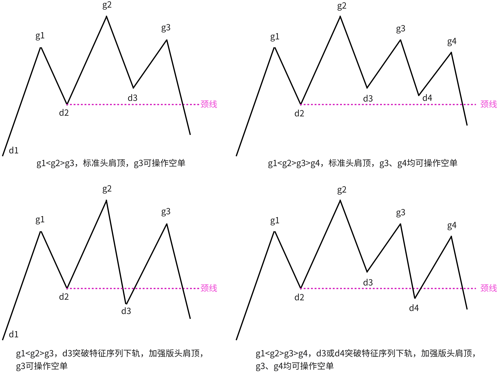

2.变种头肩

在很多时候，高点并不总是依次变低的，就会出现如下犹豫的情况，此时再等待后续形成的新高点进行比较即可。

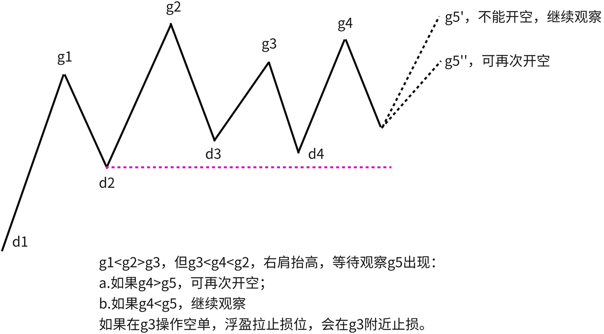

3.失效头肩

头肩顶也不一定会造成趋势反转，在「根据特征序列划分线段」中的最后一种情况，对突破特征序列又返回的情况进行二次处理。

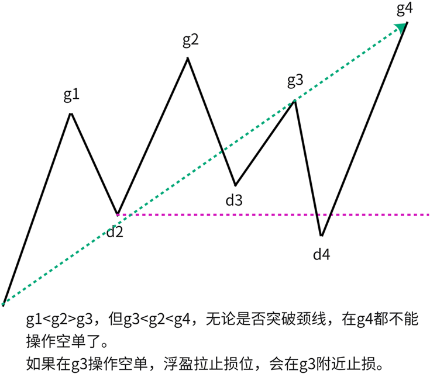

##### 头肩的结果

当以左侧视角出现头肩结构时，后市无非是两种走法：

1. 完成头肩的右侧结构，趋势反转
2. 头肩结构转换为趋势行情的内部整理

利用不新高或不新低进行的动能衰竭判定也**并不能保证一定造成走势反转，在很多时候出现头肩结构为趋势的整理部分。**

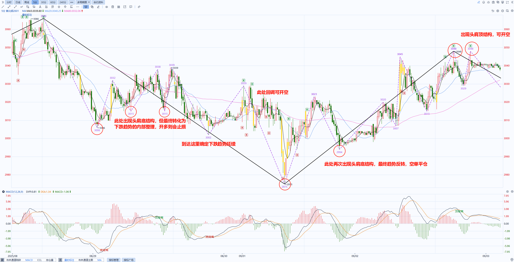

## 关键位

### 基本条件

关键位要符合如下4个条件，4个条件不一定要求同时满足，但满足条件越多越好：

1. 接触次数越多越好
2. 有过强烈的反应
3. 一眼就能看到
4. 同时做过支撑位和压力位

所谓强烈反应就是上涨趋势在到达压力区间附近时候转为下跌了，下跌趋势在到达支撑区间附近时候转为上涨了。

### 关键位的基本模式

1.波段顶底两次及以上重叠

2.波段顶底+震荡区间两次及以上的插针

3.震荡区间三次及以上的插针

**在这些波段顶底和插针位置如果出现放量滞涨或放量滞跌那就更好了！**

下图是焦煤2601合约30分钟走势图，可以看到压力支撑位多次生效：

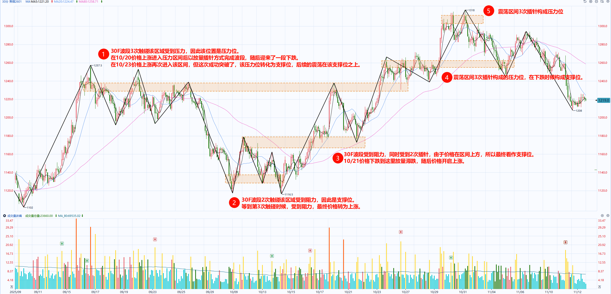

下图是尿素2601合约30分钟走势图，可以看到压力支撑位多次生效：

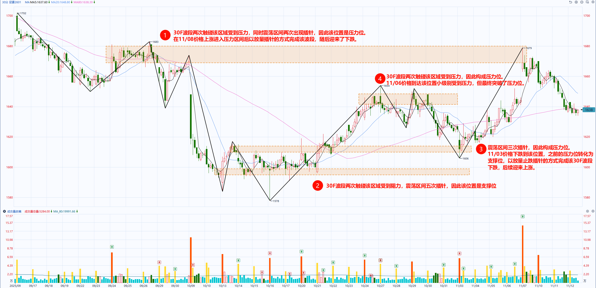

### 到达关键位附近的反应

当价格到达压力位附近时候，会有三种反应：

1. 价格在当前位置受到阻力，阻力较大，价格转而下跌，说明阻力>当前市场力量。【压力位未受阻】
2. 价格在当前位置受到阻力，受到阻力，价格在当前位置附近整理后继续上涨，说明阻力<当前市场力量【压力位受阻，但趋势延续】
3. 价格在当前位置没有受到阻力，以大阳线或者连续上涨突破，说明阻力<<当前市场力量【压力位受阻，趋势逆转】

同理，当价格到达支撑位附近时候，会有三种反应：

1. 价格在当前位置受到阻力，阻力较大，价格转而上涨，说明阻力>当前市场力量【支撑位未受阻】
2. 价格在当前位置受到阻力，受到阻力，价格在当前位置附近整理后继续下跌，说明阻力<当前市场力量【支撑位受阻，但趋势延续】
3. 价格在当前位置没有受到阻力，以大阴线或者连续下跌突破，说明阻力<<当前市场力量【支撑位受阻，趋势逆转】

在实际操作中，我们需要重点观察在到达关键位的时候价格行为如何，以上涨为例，如果到达压力位附近，显示出上涨乏力，那么就大概率不会迅速穿过，而是在受到阻力后，执行①或②的反应，反之则是③。

那么何为受阻？

**在压力位以大阳线或连续阳线突破，在支撑位以大阴线或连续阴线突破，则说明没有受阻。**价格到达关键位，出现**放量滞涨/放量滞跌、阴吞阳/阳吞阴、长上影线/长下影线、价格墨迹始终突破不了、次级别背驰**，这些迹象都表明受阻。但值得一提的是：==**价格遇到关键位受阻不代表其一定能逆转趋势，趋势延续或者逆转都是可以的。**==

下图铁矿石2601合约中，可以看到12次关键位附近，有8次压力支撑生效导致波段反转，有2次没有受到影响，有2次受到阻力后但没有造成反转。

而没有造成波段反转的4次中，有3次是在确定趋势的情况下，上涨压力位失效或下跌支撑位失效。最后1次从事后看也是如此，只不过在当下还未确定趋势反转。

对每次关键位置的试探，其实就是市场已有的力量和当前力量的比较。在一些波段方向转换的地方，容易出现②情况，就是受到阻力也未造成反转，说明新力量较强了。上图最后一次，可以看到价格上涨到达压力位附近，此时应该是做空预期，但走势虽然受到阻力随后却突破压力位了，说明当前的多头力量够强，可以讲30分钟趋势在这里大概率转多了，后续要以做多预期操作。

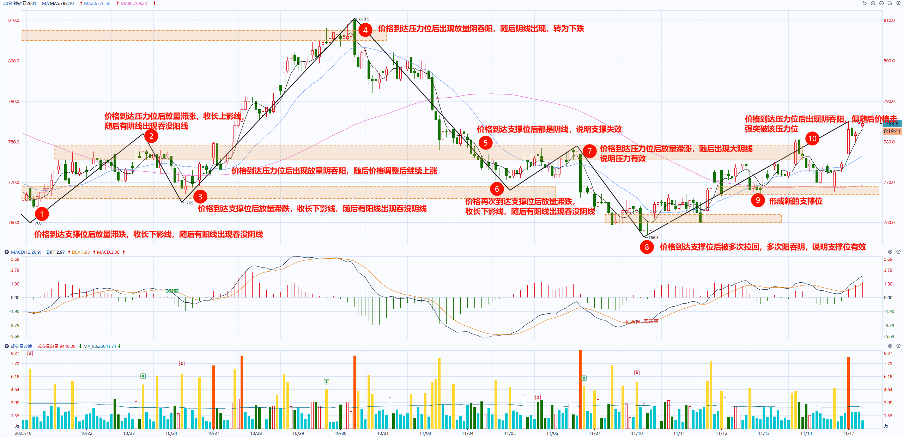

## 量价分析

## 市场结构分析

### 分析目标

在交易中，常常听到一句话，叫做顺势而为，可为什么非要顺势而为，不顺势不行吗？啥叫顺势？

按照之前的理解，以30F为持仓目标，那么所谓顺势而为的开仓机会无非是两种：

- 确定4H线段方向，找30F反向回调段，目标操作30F推动段
- 确定4H线段方向，30F线段和4H线段方向相同，找5F笔为反向回调，目标操作30F推动段

这种思路对吗？对于大多数交易者来说，这就是所谓顺势而为，针对确定大级别的回调操作。但我觉得只能说在一定程度上是对的，因为4H线段方向的确定一定是非常滞后的，假如4H级别逆转趋势，那么30F走势要么是走的非常远的顺势段，要么是已经开始了第2笔回调段了。这样以来，其实能操作的是符合标准回调结构的顺势第3段了，但很多时候第3段空间并不大。

下图所示是棕榈油2605合约走势，可以看到均线金叉确定4H转多非常滞后了，然后第1次回调位置小级别又没给机会，第2次回调给机会了，此时的行情利用率就非常低，明明涨了这么大的空间，却能操作的很少。

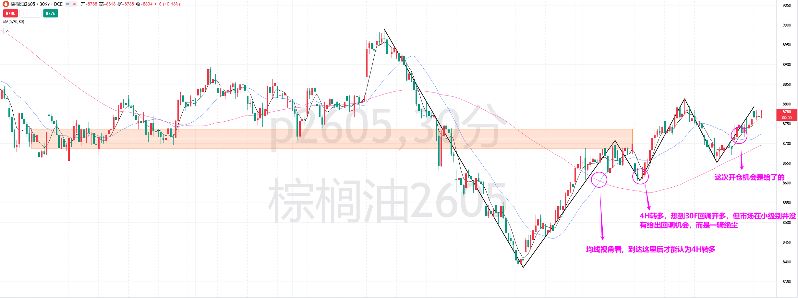

这说明之前的想法是不够深刻的，我觉得顺势而为在于以行情推动段操作，操作的难度会更低，盈利空间也会更大。但问题是确定了4H线段方向，当前30F推动段不一定和4H段方向相同，30F推动段可以是新的4H线段内部的第1段，另一方面是4H线段内部的最后推动段的幅度往往不大且不知道啥时候能结束。

不仅仅是小级别行情判断有滞后，大级别更有，而且大级别的滞后尤甚。因此需要切换分析思路，我觉得重点从下面分析：

1. 30F级别走势在干嘛？当前30F线段是推动段还是回调段？这个30F线段是刚开始还是快结束呢？
2. 关键位置有没有阻力？

简单来说，目标就是确认当前30F线段的空间。在我看来，如果要操作30F线段，就是三种情况：

- **当前30F线段要结束，操作反向30F线段**
- **当前30F线段方向确定，操作顺向30F线段**
- **当前震荡方向不明，等待震荡结束**

### 本级别观察其他级别

为了在看盘时候不被多周期同时盯盘造成扰动，因此必须学会在本级别去看次级别结构，另外大一个级别的结构也要能看到。

在本级别看次级别走势，上涨线段如果出现阴线低点突破左侧阳线低点，那么就构成次级别的回调；同理，下跌线段如果出现阳线高点突破左侧阴线高点，那么也构成次级别的回调，如此就能在本级别图上看到次级别的走势情况了。

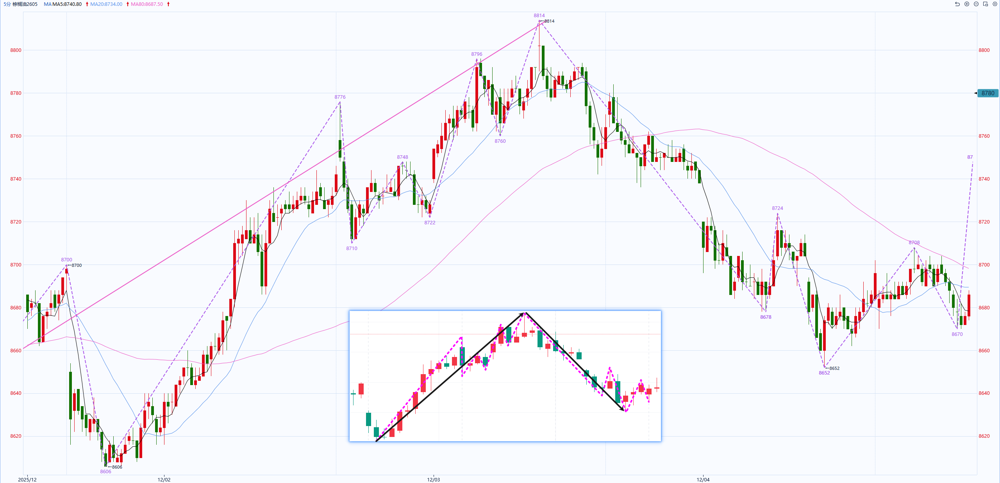

而在本级别看大级别，就更容易了，按照特征序列划分线段方式递归即可。

### 走势空间的确定

走势空间的确定有三个因素：**30F走势结构、当前30F方向、关键位**。

#### 棕榈油2605

如图是棕榈油2605合约：

- 走势结构：30F走势维持震荡，当前有30F上涨段突破震荡区域上轨，因此后续整体看多
- 当前30F方向：30F下跌段
- 关键位：8837为支撑位

那么可得后续走势预期，30F下跌段到达8837支撑位附近止跌，随后开启30F上涨段，整体走势转多。

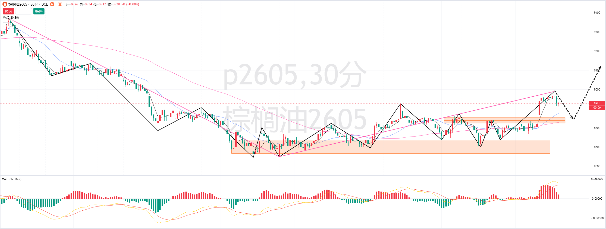

但现实是走势并没有符合预期，相反跌穿了支撑位，那么预期就变了。

- 走势结构：30F走势维持震荡，当前有30F上涨段突破震荡区域上轨，但30F下跌突破支撑位，因此后续仍旧偏震荡
- 当前30F方向：30F下跌段
- 关键位：8702支撑位

可得后续走势，就是30F下跌段到达8702支撑位后止跌，然后运行30F的震荡走势。

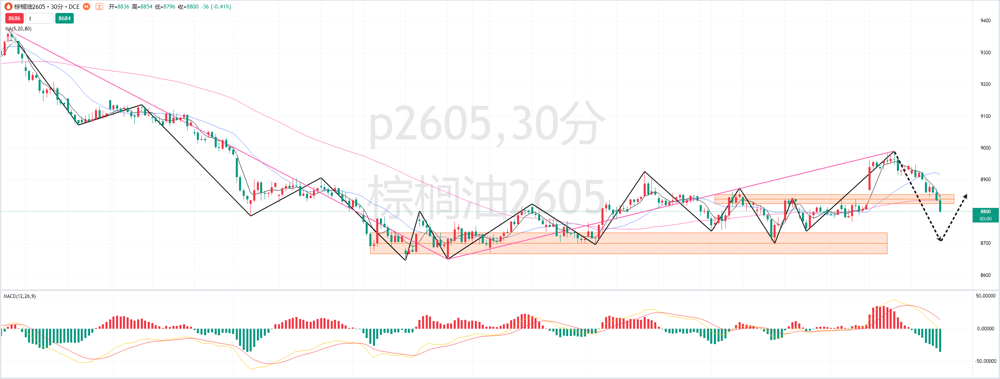

可惜的是30F下跌段在8702支撑位并没有撑住，相反继续下跌。

- 走势结构：30F走势维持震荡，当前30F下跌段在8702支撑位受到次级别的支撑，但随后价格仍旧偏弱
- 当前30F方向：30F下跌段
- 关键位：8702支撑位、8606支撑位

那么可得后续走势，30F下跌段跌破8702支撑位置，然后到达8606支撑位附近，后续走势会偏空。

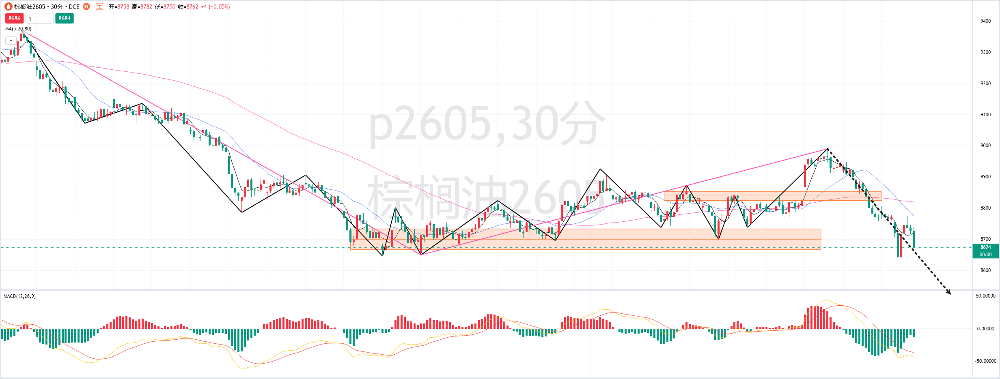

### 行情的筛选

有些走势，看一眼就知道有缘，知道做进去就会赚钱；有些走势，看一眼就觉得恶心，做进去坑坑洼洼难受得要死。

做波段交易，如果没有波动，那么再咋折腾也是费力不讨好，再怎么优化开仓信号，也会经常止损。那么就是要找波动较大的行情，

## 量的分析

## 市场环境氛围

### 市场的整体情绪

很多品种之间会形成盘面的联动，类似于整体涨或整体跌的情况，尽管它们没有在一条产业链上，这种市场整体的同涨同跌现象，就是市场情绪。

以2025/12/12这天夜盘来说，这周氧化铝、黑色、纯碱玻璃、化工等品种迎来以一周的下跌，在周五晚上它们集体反弹，如果持仓这些品种的较多空单，那么此时利润会大幅度回撤。

## 以30分钟线段为目标的操作

### 5F开仓结构

### 开仓信号

1.标准5F级别回调

- 5F图上出现两次依次抬高的阳包阴
- 5F图上出现较强势的跳空阳包阴

2.小于5F级别回调

- 5F图上出现一次阳包阴

### 止损

#### 硬止损【被动止损】

硬止损的目的是保命，因为很多时候会有极端情况，如图是LPG2602合约5分钟走势图，确定30F下跌段，那么5F回调开空是符合开仓逻辑的，属于中途上车，开空位置是4193，那么止损位置就是4201，在当天夜盘开盘，LPG突然暴涨，那么此时无论如何都要止损。

这种**反向跳空的情况，有时候会挂单挂不上，所以在早盘开盘、午盘开盘、夜盘开盘时候必须处于盯盘状态**，倘若持仓的品种出现异常，就要及时止损，避免亏损进一步扩大。

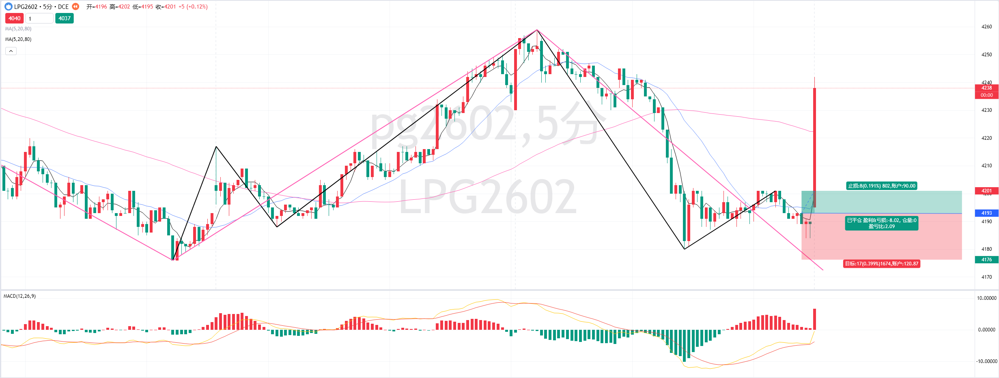

#### 出现反向开仓信号【主动止损】

硬止损是关键保命用的，而不是所有时候都必须打到硬止损，有些时候看到情况不对就要主动离场。硬止损的空间幅度较大，而很多时候看到盘面不对就主动止损，其实是减少单次止损亏损，控制回撤。

如图是沪锡2601合约30分钟走势图，当前30F构成二次衰竭且MA20趋下，说明4H线段较大可能转空，因此尝试做空。开仓位置是确定30F下跌段，然后内部5F回调做空，开仓逻辑上是没有问题的。但后续观察到5F级别出现头肩底且30F的MA5趋上，说明30F下跌段可能结束，后续较大可能会转为震荡，开始30F上涨段，因此这里即使没有打到硬止损线也要提前离场，甚至说要反手做多。

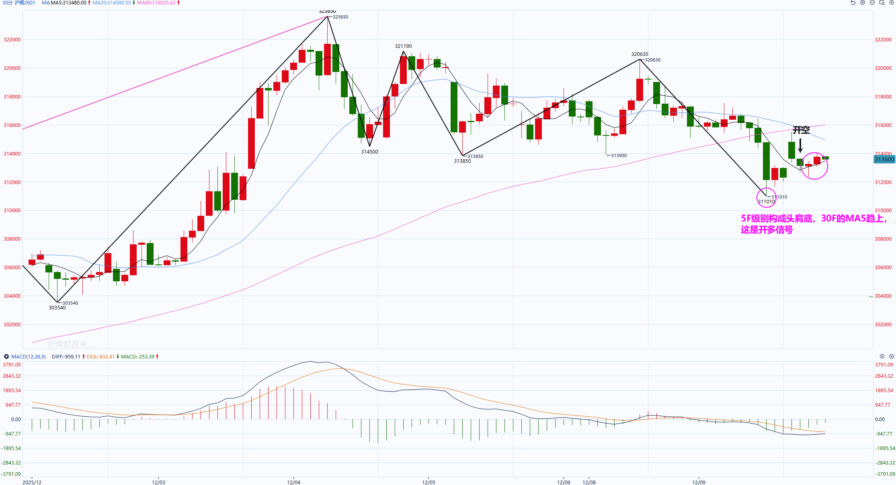

从后续看，这里主动离场选择是非常正确的，出现开多信号，于是就反手开多。

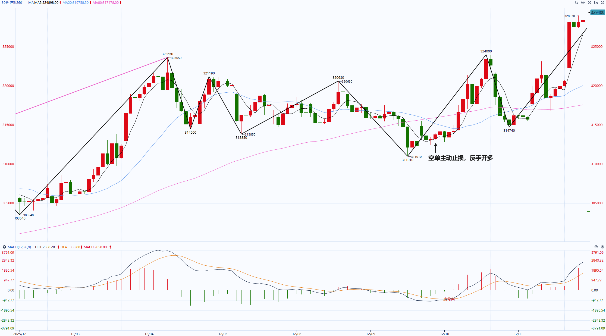

#### 走势很弱偏震荡【主动止损】

如果开仓后走势很弱，迟迟不按预期，那么说明后续就很难按预期走了。尤其是操作和30F走势结构相反的30F线段，只有弱势，就说明反弹力度有限，后续大概率还会沿着之前先前方向走。

当走势预期上涨或下跌时，**迟迟不动，小幅横盘震荡，MA5趋向开始打破开仓信号，这时候可以提前止损离场。**

---

如图是甲醇2605合约30分钟走势图，可以看到当前位置5F走势构成二次空头衰竭，同时30F的MA5趋上，压力位在2160附近，所以该处30F上涨段预期能先到2160，然后再开启30F下跌段。

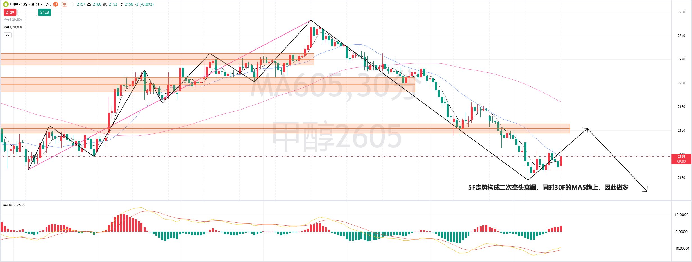

但最终30F反弹笔并没有涨到2160，可以观察到走势磕磕绊绊就是上不去，后续MA5开始趋下。因为是逆30F走势做反弹一段，所以30F回调段的弱势说明后续会有30F下跌段，因此当前位置的多单就不必止损位，可以提前离场。

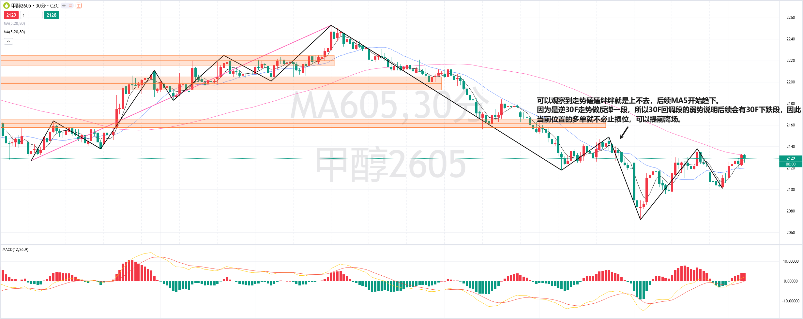

如图是花生2603合约30分钟走势图，可以看到30F构成头肩底结果，因此后续预期能有30F上涨一段带动30F走势结构转多，那么之前的4H回调段则是以盘整背驰方式完成。如果走势按照下图方向走，那是多漂亮啊！

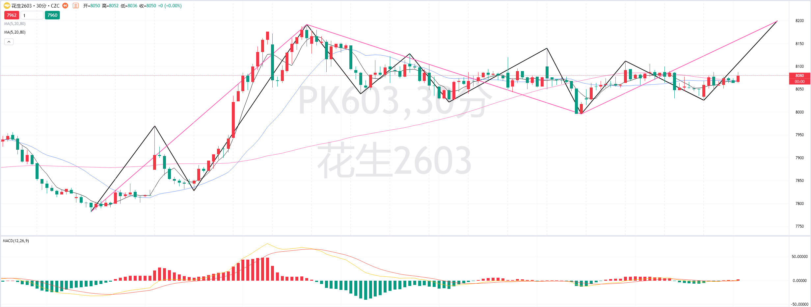

但后续走势偏弱，在当前位置附近就是磕磕绊绊，迟迟上不去，随后MA5开始趋下，开启了30F下跌段。

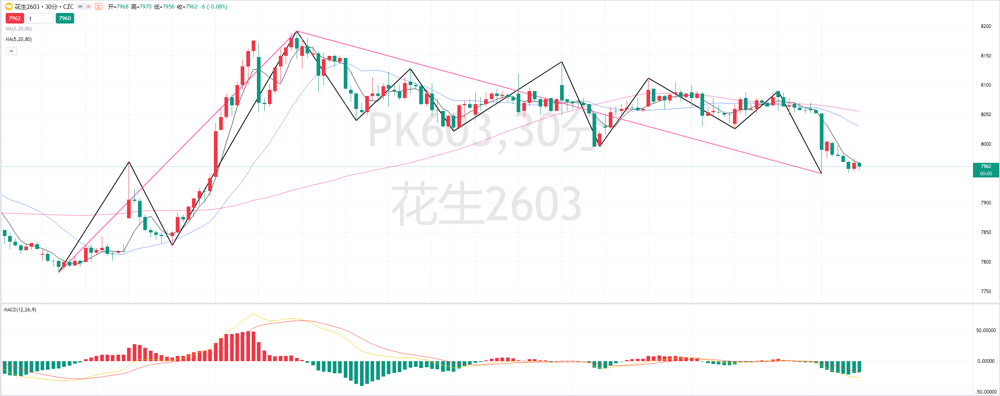

### 止盈

#### 移动止盈位

交易讲究的是权衡，移动止盈位的方法在某些时候会导致错过大行情，但我们需要明白，市场走单边大行情的情况并不是大多数，移动止盈位的方式在很多时候能让利润回撤不至于太多。

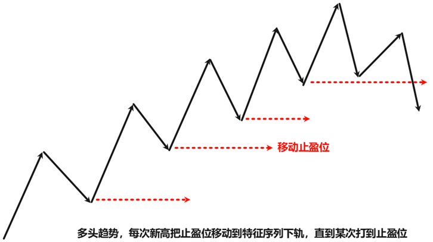

#### 到达关键位时弱势

当走势力度较弱，走起来磕磕绊绊，则可在压力支撑位置挂止盈单，这样价格扫到目标价立即离场。另外一种情况是，走势到达压力支撑位置时候出现停滞，此时可以止盈离场。

当走势到达关键位时候出现如下三种情况，可以止盈：

- 走势力度较弱，走起来磕磕绊绊
- 到达关键位时候停滞
  - 放量滞涨/放量滞跌，出现长上影线/长下影线
  - K线实体变小，价格迟迟突破不了，小幅震荡，30F的MA5趋向改变

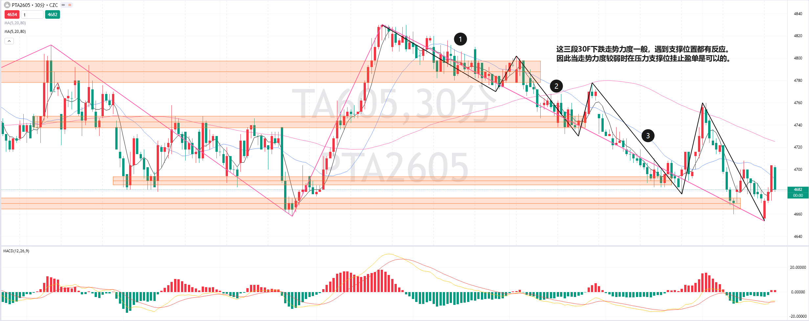

#### 反向开仓信号

从结构上说，是最完美的平仓点位，而且在这时候还能反手开仓。

#### 脉冲式暴涨暴跌

出现脉冲式暴涨暴跌行情，可以随时平仓止盈，因为暴涨暴跌对消耗动能非常大，很容易突然掉头。如图是纸浆2605合约30分钟走势图，可以看到突然的暴涨价格新高了，所有没有压力位，但暴涨后一定会有大量获利盘平仓止盈，所以行情会掉头回调。

持仓品种出现符合预期的暴涨暴跌，会有大幅度浮盈，此时差不多离场是可以的，不必要求结构信号，大概率不会出现。

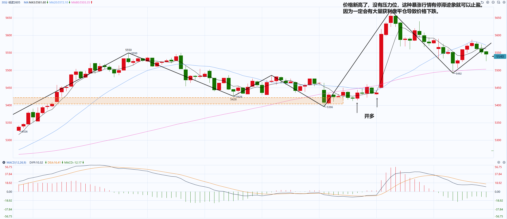

### 回调交易的理想与现实

既然是交易，那么肯定有符合预期时候，也有不符合预期时候。

#### 1.少了MA20趋向条件【FG2601】

如图是玻璃2601合约5分钟走势图，可以看到有一笔5F上涨突破特征序列上轨了，但随后走弱，以阳包阴+MACD绿柱缩小为开仓信号，最终预期30F下跌线段逆转，走势转为向上。

但仔细观察开仓位置的MA20趋下，那么做多就应该再等等。耐心多等待几根K线，这单亏损的交易就可以避免。

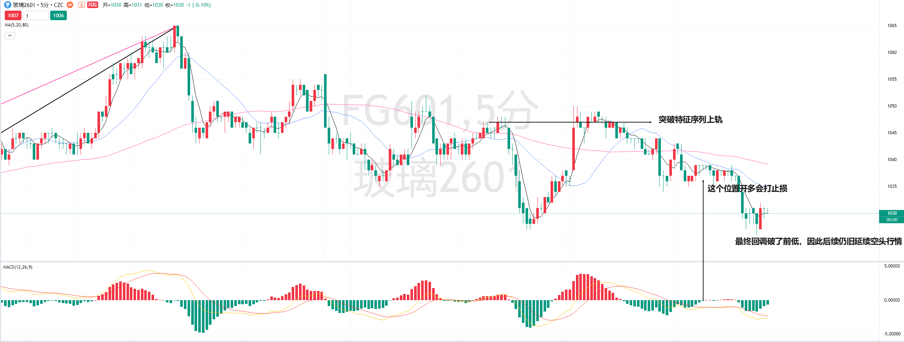

#### 2.MA20趋向条件不明确【pg2602】

如图是LPG2602合约30F走势图，可以看到次级别5F出现头肩顶，30F的MA5趋下，所以开了空。但随后走势偏强，价格上涨，MA5开始趋上，此时就要主动离场。

或者说从一开始30F的MA5趋向就不是太明确，所以这种偏震荡的走势一开始就不应该入场。

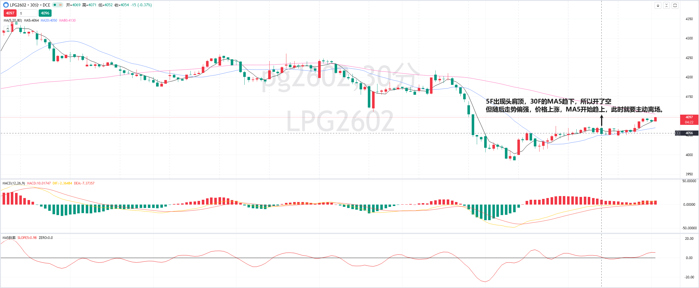

#### 3.没有回调开仓机会【jm2605】

如图是焦煤2605合约30F走势图，可以看到当前位置构成头肩底，且MA20趋上，因此后续看30F走势反转，择机做多。当前30F上涨段，后面预期则是5F回调到位后开多即可。

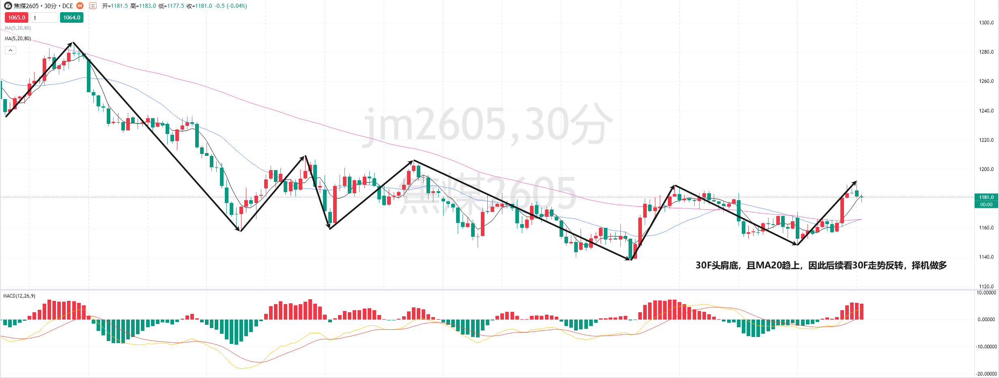

但现实是这里没有走出上涨预期，相反开启30F下跌段，而且这个30F下跌段是没有给5F回调入场机会的。

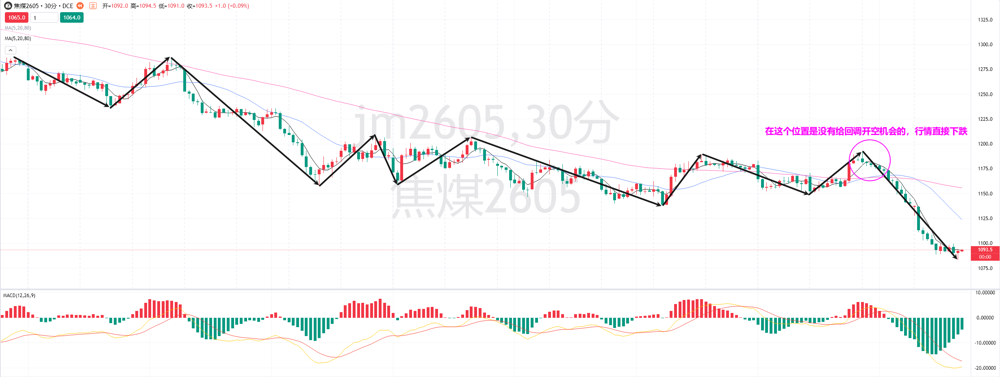

#### 4.没有回调开仓机会【p2605】

如图是棕榈油2605合约30F走势图，可以看到①处突然暴跌，②处暴涨，那么这两处是无法匹配交易系统规则的，就抓不到了。

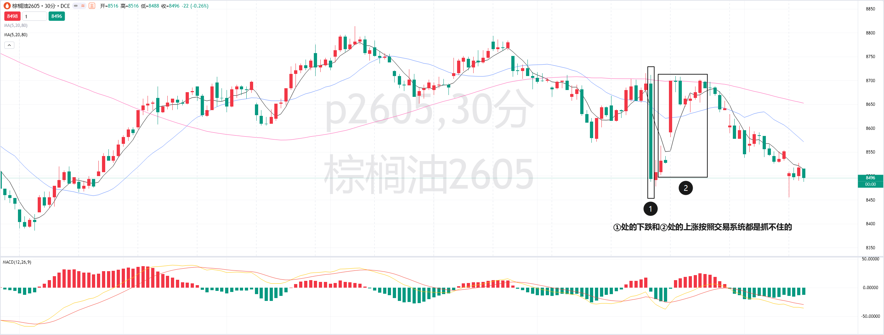

#### 5.开仓后预期笔力度不够【sn2602】

如图是沪锡2602合约5分钟走势图，可以看到30F下跌线段是确定方向的，因此等5F回调结束开空。这种开仓逻辑是没有问题的，但市场最终没有给出好的回应，沪锡的**5F下跌未能突破前低**，最终构成空头二次衰竭结构，那么持仓的空单无论如何都要离场。

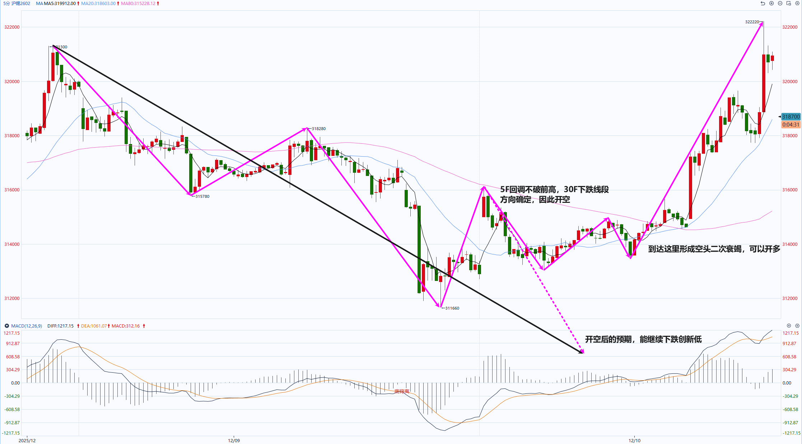

#### 6.开仓后预期笔力度不够【sp2605】

如图是纸浆2605合约5分钟走势图，可以看到30F下跌线段是确定的，同时MA20趋下，于是想到5F回调开空，预期能突破5426构成新低，但最终**5F下跌未能突破前低**，走势转强，这单交易止损。

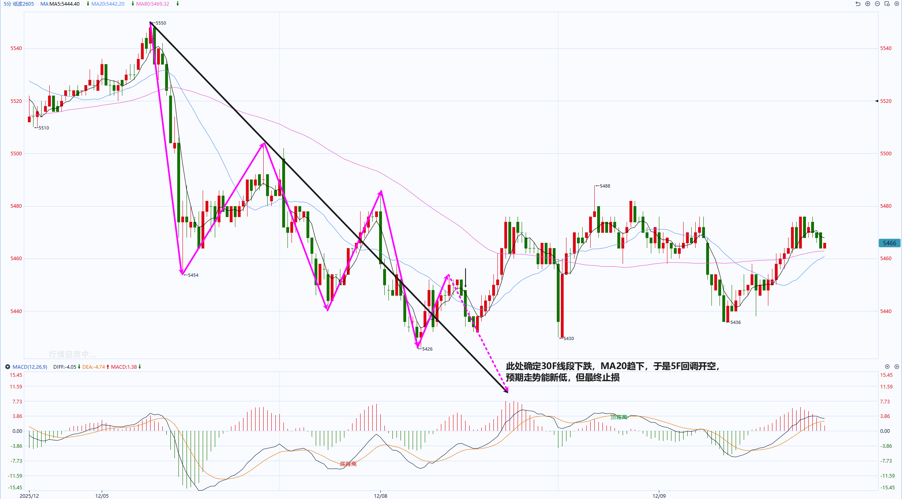

#### 7.开仓后走势陷入震荡【PK2603】

如图是花生2603合约5分钟走势图，可以看到MA20金叉MA80，于是5F回调做多，预期走势向上。开仓逻辑没有问题，但市场没有给出回应，**走势陷入长时间震荡**，这单持仓也非常不顺，最终暴跌突破震荡区间，多单止损。

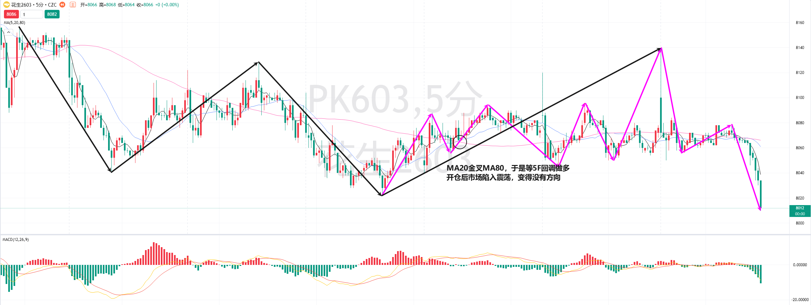

## 盈亏控制和仓位管理

### 凯利公式

### 交易盈亏分析

在交易过程中，存在五种情况：保本离场，小亏，小赚，大亏，大赚。这五种情况的产生，需要由交易系统和行情共同决定。在这里不考虑操作变形的可能性。

1.保本离场

根据交易系统进行入场，并且行情顺着交易系统预测方向走了一段路程，交易者上浮止损点，而后行情回调，打到止损点，所以保本离场。

2.小亏离场

根据交易系统，交易者入场，行情没有按预期运行，打掉交易者的硬止损点，直接小亏离场。

当出现频繁小亏时候，就是两种原因：

- 逆势操作
- 震荡行情操作

3.小赚离场

根据交易系统入场，行情确实向上走了一段行情，而后交易者上移止损点到盈利的位置，而后行情回调，被打掉止损点。

4.大亏离场

大亏时候有三种原因：

- 根据交易系统下注，但**没有设置止损点**，交易者在亏损情况下选择**扛单**，结果越亏越多。
- **仓位过重**，导致小的波动也能造成大的亏损。
- 出现极端行情，持仓品种**反向跳空或者暴涨暴跌时候做错方向**。

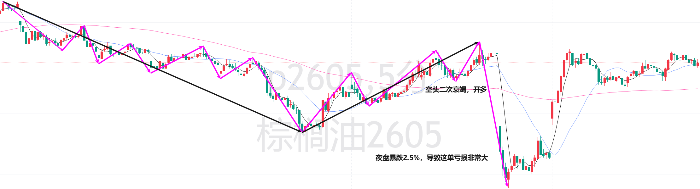

5.大赚

这是交易者最希望发生的事情，交易者根据交易系统进行入场，而后行情向着好的方向发展，交易者上移止损点，但是行情始终没有回调到止损点，而后行情一路向上，到某一次，触发到交易者的已经大幅度上移的止损点。

总结来说：**小浮盈不能转化为小亏损，保本出都比亏损强。**当行情按照预期走了一段后，可以把止损线拉到开仓价位。

### 波动分配的物理现实

以右侧交易的视角去操作某个波段，那么很难开仓和平仓在波段的端点，就势必导致行情的浪费。

波段总长=止损空间+盈利空间+止盈空间+手续费成本

### 品种手数确定

[‍⁠⁠⁠‌‌‍‌‍‌⁠⁠‍‍‍‍⁠‬⁠‍‌‍‬操作手数 - 飞书云文档](https://lcne3g4pog0o.feishu.cn/base/BvtpbcQXhaR0CdsK4bgc2wKHnuh?table=tblD8KDFuRHdqeqr&view=vew3eP5L4T)

### 节假日平仓

## 盯盘和复盘

### 开仓检查

某个位置要不要开仓，需要确定缘由，因为预期是能做30F较长一段，这段空间越大越好，因此在开仓前需要检查当前位置是否开仓：

#### 1.30分钟走势结构

30分钟走势结构分析是最重要的，因为在5分钟图中信号不是所有都有用的，要通过30F走势结构筛选掉利用的信号，这个由大到小的过程不能搞反了！

确定震荡区间位置，这是潜在压力支撑位。

- 当前价格在震荡区间外：如果做多，观察当前位置距离上方震荡区间下轨有多大空间；如果做空，观察当前位置距离下方震荡区间上轨有多大空间。
- 当前价格在震荡区间内：如果做多，观察当前位置距离当前震荡区间上轨有多大空间；如果做空，观察当前位置距离当前震荡区间下轨有多大空间。

当预期空间足够大的时候，才有操作必要，如果空间较小，就不必操作了。

#### 2.5分钟开仓信号

在5分钟图上，出现阳包阴或阴包阳的位置就是潜在的开仓点位，但这仅仅是5分钟级别的，还需要在30分钟图上看当前位置是否适合开仓。

下面指标给出波段头肩顶/头肩底后的包含K线，在实际开仓时候还需要观察5分钟级别的MA20趋向如何。

#### 3.硬止损空间

在开仓前，要确定这次操作最多接受亏损多少。当前开仓位置到达能接受的硬止损线空间有多大，一般品种幅度最好不大于0.5%，波动大的品种最好不大于0.8%。

### 每日任务

| 时间        | 工作                                                         |
| ----------- | ------------------------------------------------------------ |
| 8:45~8:59   | 提前打开看盘软件和交易软件，刷微博看有没有消息               |
| 8:59~9:00   | 观察持仓是否有大幅反向跳空，如果有要准备离场                 |
| 9:00~10:15  | 盯盘                                                         |
| 10:15~10:30 | 修盘时候看哪些品种可能有潜在机会                             |
| 10:30~11:30 | 盯盘                                                         |
| 13:10~13:30 | 无间复盘                                                     |
| 13:30~14:50 | 盯盘                                                         |
| 14:50~15:00 | 收盘检查，观察持仓品种是否滞涨或止跌，若有则离场，避免夜盘跳空 |
| 19:30~20:50 | 每日盘面分析、操作记录，看外盘情况                           |
| 20:50~20:59 | 提前打开看盘软件和交易软件，刷微博看有没有消息               |
| 20:59~21:00 | 观察持仓是否有大幅反向跳空，如果有要准备离场                 |
| 21:00~23:00 | 盯盘                                                         |

