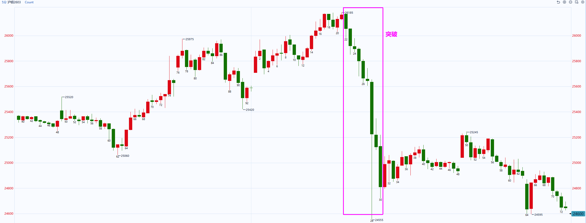
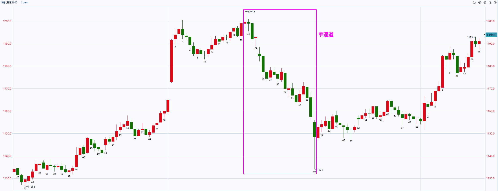
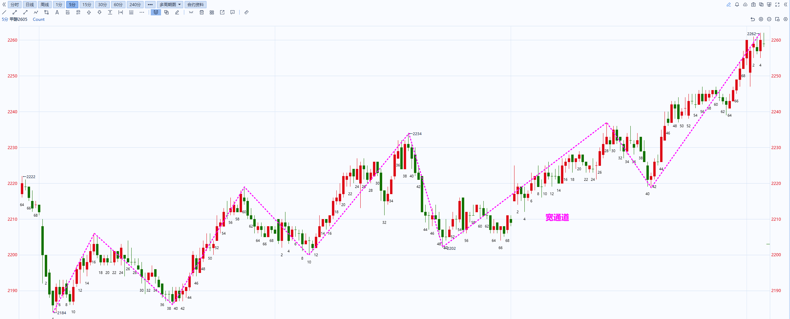
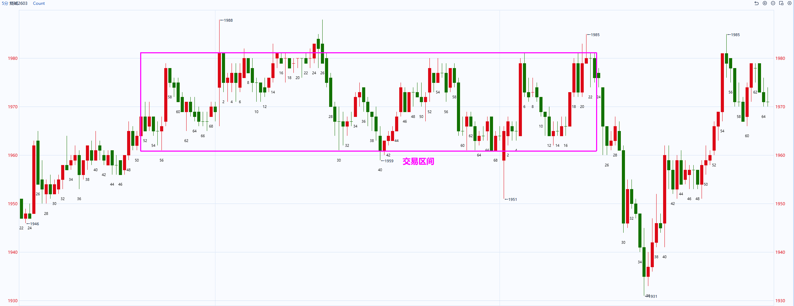
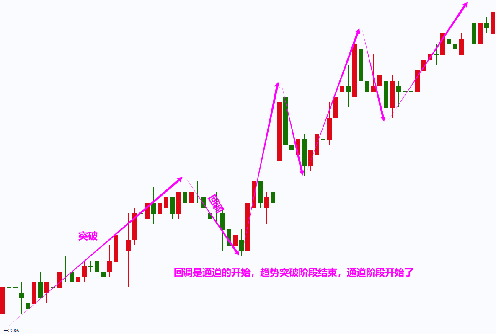
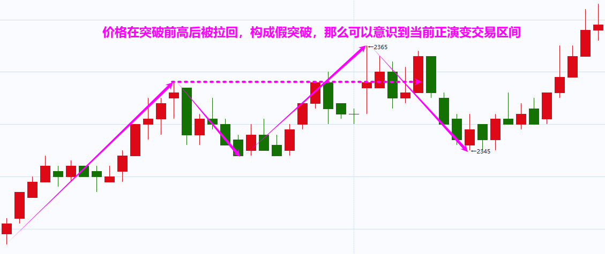
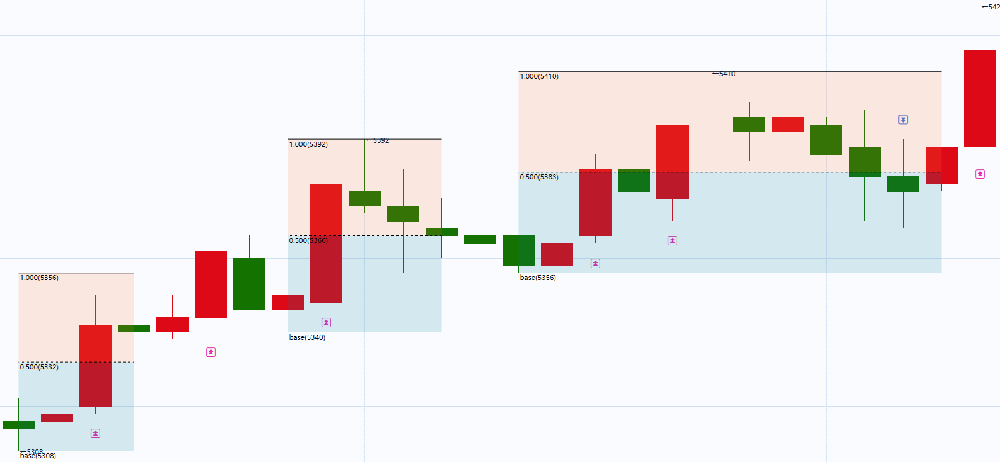
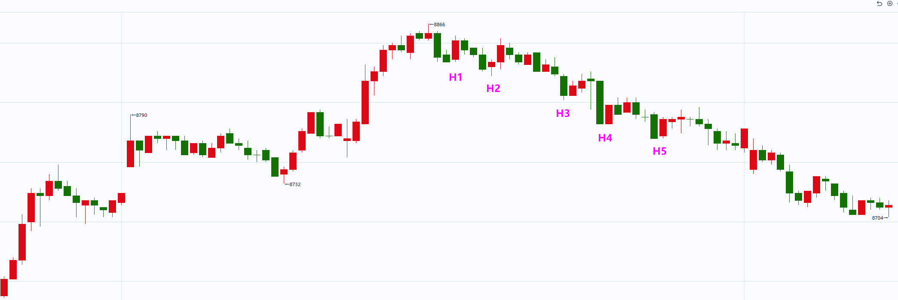

# 期货短线交易系统v2版

## 走势结构划分

## 市场状态

### 市场的4种状态

Al brooks认为市场分为4种状态：突破、窄通道、宽通道、交易区间。而缠论认为是两种：趋势、盘整。

#### 突破

特征：

- 由一系列强趋势K组成，实体大；
- K线之间重叠很少，几乎没有回调

交易策略：

- 方向唯一：顺突破方向交易，严禁逆势操作
- 交易方式：波段交易

#### 窄通道

特征：

- 趋势方向明确，但开始出现回调
- 回调通常短暂（1~3根K线）且幅度浅

交易策略：

- 方向唯一：顺突破方向交易，严禁逆势操作
- 交易方式：波段交易

#### 宽通道

特征：

- 趋势方向明确，出现回调
- 回调深入且持久（5~20根K线）
- 逆势交易者开始有机会通过剥头皮盈利

交易策略：

- 双向机会：顺势逆势均可操作
- 操作方式：
  - 顺势交易：上涨宽通道回调买入或下跌宽通道反弹卖出
  - 逆势交易：剥头皮交易，上轨卖出下轨买入

#### 交易区间

特征：

- 市场失去明确方向，主要进行横向运动
- 通常指持续20根K线以上的盘整
- 80%的突破尝试会失败

交易策略：

- 双向机会：顺势逆势均可操作
- 操作方式：高抛低吸，区间上三分之一卖出，下三分之一买入，以剥头皮为主，赚取小额利润。

### 状态演变

#### 演变路径

市场状态通常遵循 **突破 --> 通道 --> 震荡区间 --> 新的突破** 的循环。

#### 趋势始于突破

突破是趋势的开端，是趋势中最强劲的部分，一旦出现回调，则突破阶段结束。

#### 回调是通道的开始

回调是通道的开始，**一旦出现回调，则意味着趋势的突破阶段已经结束，通道阶段开始了**。

#### 通道演变为交易区间

通道最终减弱并演变为交易区间。

在上涨通道中，空头剥头皮交易者通过在前高设置限价卖单并成交获利，这是出现交易区间的第一迹象。

在下跌通道中，多头剥头皮交易者通过在前低设置限价卖单并成交获利，这是出现交易区间的第一迹象。

也就是说出现假突破，通道会演变为交易区间。

## 回调

### 回调的形成及要求

回调的形成：上涨/下跌趋势为例，多头/空头投资者为了防止风险过大会逐步获利了结，市场就会出现回调，并可能陷入横盘整理。

回调的最低要求：

- 上涨趋势中的回调：指某根 K 线的最低点低于前一根 K 线的最低点。
- 下跌趋势中的回调：指某根 K 线的最高点高于前一根 K 线的最高点。

回调交易的目的：**回调是趋势中的暂时停顿，为交易者提供高胜率的入场机会**。

### 趋势尝试恢复

#### 数K线

上涨/下跌趋势中，将尝试恢复上涨/下跌的信号点进行数字标记。恢复上涨标记为`H(num)`，恢复下跌标记为`L(num)`。

那么实际上出现恢复上涨/下跌的信号K线组合大多数就是那几种：

- 顶底分型
- 包含
- 长上影线且为阴线、长下影线且为阳线

这些K线组合表示价格到底某个位置后被反向拉回，受到另一方较强阻力。

如图是纸浆2605合约5分钟走势图，标记出上涨恢复的信号点。

#### H2/L2是高胜率入场点

1.双重力量推动：顺势交易者看到趋势恢复的第二次尝试会认为是高概率入场点；逆势交易者的回补行为进一步推动价格朝趋势方向发展。

2.供需失衡：H2买点，多头开仓买入和空头平仓买入，缺乏卖方；L2卖点，空头开仓卖出和多头平仓卖出，缺乏买方。这导致价格更容易向趋势方向移动。

### 50%回调

核心逻辑：在一段趋势段的50%位置，**顺势交易者和逆势交易者的潜在盈亏比是相同的**（1:1）（目标为前期高/低点，止损为波段起/终点）。

概率优势：在趋势背景下，顺势方的胜率更高（例如60% vs 40%）。这使得50%水平成为一个具有数学优势的、机构非常青睐的入场点。

应用：交易者常在上涨趋势的50%回调位挂限价单买入，或在下降趋势的50%反弹位挂限价单卖出。

如图是纸浆2605合约30分钟走势截图，也就是上图中的30分钟周期，可以看到很多次回调到底50%附近，然后继续之前的趋势。

### 回调时间过长是风险

如果回调继续发展，可能会演变成相反的趋势。当回调增长到20或更多K线，则是无休止的回调，多头突破的可能性降低到与空头突破大致相同。

如图是棕榈油2605合约5分钟走势，本来是上涨趋势，因此会在H2附近入场做多，期望维持上涨趋势，但后续回调时间变长，不断出现H3、H4，回调演变成了空头趋势。

## 走势的强弱

### K线强弱

