# 期货短线交易系统v2版

## 走势结构划分

## 回调

### 回调的形成及要求

回调的形成：上涨/下跌**趋势**中，多头/空头投资者为了防止风险过大会逐步获利了结，市场就会出现回调，并可能陷入横盘整理。

回调的最低要求：

- 上涨趋势中的回调：指某根 K 线的最低点低于前一根 K 线的最低点。
- 下跌趋势中的回调：指某根 K 线的最高点高于前一根 K 线的最高点。

回调交易的目的：**回调是趋势中的暂时停顿，为交易者提供高胜率的入场机会**。

### 回调的3种模式

1.反向K线作为回调

常见于窄通道行情，回调不足以改变趋势。因此回调是不错的入场点。

2.反向段作为回调

常见于宽通道行情，回调不足以改变趋势，但回调力度比反向K线更强。由于整体没有改变趋势，回调是不错的入场点。

3.反向通道作为回调

出现反向通道或交易区间构成回调，这种回调在更高周期图上看就是反向段。出现反向通道时候，趋势方向其实已经改变了，这是站着更高周期看的。

如图是纸浆2605合约5分钟走势图，可以看到三种回调方式：

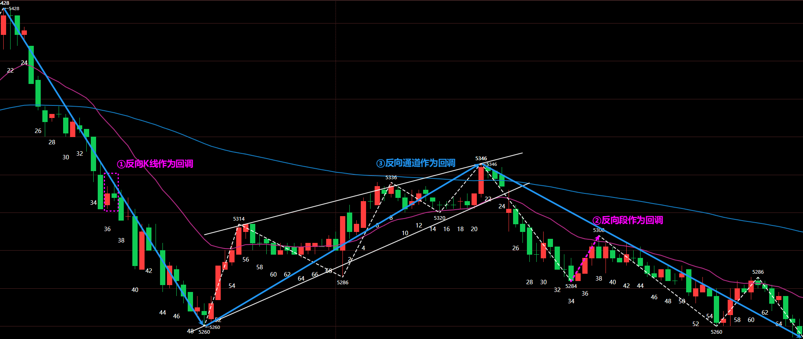

如图是纸浆2605合约30分钟走势图，可以看到在5分钟图上的反向通道构成的回调，在30分钟图上就是反向段。

### 趋势尝试恢复

#### 数K线

上涨/下跌趋势中，将尝试恢复上涨/下跌的信号点进行数字标记。恢复上涨标记为`H(num)`，恢复下跌标记为`L(num)`。

那么实际上出现恢复上涨/下跌的信号K线组合大多数就是那几种：

- 顶底分型
- 包含
- 长上影线且为阴线、长下影线且为阳线

这些K线组合表示价格到底某个位置后被反向拉回，受到另一方较强阻力。

#### H2/L2是高胜率入场点

1.双重力量推动：顺势交易者看到趋势恢复的第二次尝试会认为是高概率入场点；逆势交易者的回补行为进一步推动价格朝趋势方向发展。

2.供需失衡：H2买点，多头开仓买入和空头平仓买入，缺乏卖方；L2卖点，空头开仓卖出和多头平仓卖出，缺乏买方。这导致价格更容易向趋势方向移动。

### 50%回调

核心逻辑：在一段趋势段的50%位置，**顺势交易者和逆势交易者的潜在盈亏比是相同的**（1:1）（目标为前期高/低点，止损为波段起/终点）。

概率优势：在趋势背景下，顺势方的胜率更高（例如60% vs 40%）。这使得50%水平成为一个具有数学优势的、机构非常青睐的入场点。

应用：交易者常在上涨趋势的50%回调位挂限价单买入，或在下降趋势的50%反弹位挂限价单卖出。

如图是纸浆2605合约30分钟走势截图，也就是上图中的30分钟周期，可以看到很多次回调到底50%附近，然后继续之前的趋势。

### 回调时间过长是风险

**如果回调继续发展，可能会演变成相反的趋势**。当回调增长到20或更多K线，则是无休止的回调，多头突破的可能性降低到与空头突破大致相同。

如图是棕榈油2605合约5分钟走势，本来是上涨趋势，但由于回调时间过长，最终转变为下跌趋势了。

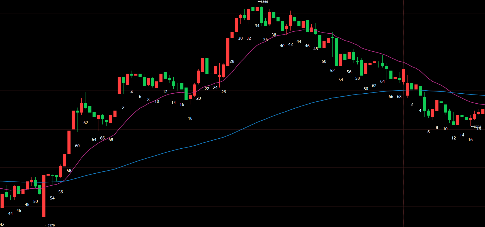

## 市场状态及演变

### 市场的4种状态

市场分为4种状态：**突破、窄通道、宽通道、交易区间**。

| 市场周期 | 特征                                                         |
| -------- | ------------------------------------------------------------ |
| 突破     | 一段结构，方向明确，该段由**一系列强趋势K构成**，K线之间重叠很少，几乎没有回调。 |
| 窄通道   | 一段结构，方向明确，该段**回调短暂（1~3根K线）且幅度浅**。   |
| 宽通道   | 多段结构，方向明确，段作为回调，**回调深入且持久（5~20根K线）**。 |
| 交易区间 | 多段结构，**方向不明**，持续20根K线以上整理，**80%突破尝试会失败**。 |

### 市场的2种走势类型

市场分为2种走势类型：**趋势和盘整**。

1. 趋势的高低点同向抬高或同向变低，显示为有方向；而盘整的高低点并不同向变化，显示为无方向。

2. 一段式结构一定是趋势，因为其内部构成趋向性。多段式结构需要根据段的高低点位置判断是否有趋向性。
3. **特征序列重叠范围越大，趋向性越弱；特征序列重叠范围越小，趋向性越强**。特征序列没有重叠范围，趋向性非常强。

按照趋向性强度，可以这样排列，越靠近两端趋向性越强：

突破、窄通道是标准的趋势行情，交易区间是标准的盘整行情，而宽通道需要关注其斜率大小来判断趋向性如何。

### 突破

#### 真假突破

**当出现突破行为时，需要后续确认和跟随**。在突破位置出现如下现象，就是成功率高的突破：

- 突破K线为大阳线大阴线，或者连续阳线连续阴线。
- 阳线上影线很短，阴线下影线很短。
- 收盘价让另一方套牢
  - 阴线收盘在震荡区间下轨下方，阳线收盘在震荡区间上轨上方。
  - 被套牢的K线数量越多说明被套牢的筹码越多
- 突破K线形成时候不磨磨唧唧，而是一气呵成。

有时候出现真突破会有小段失败反转尝试，这只是次级别的回调。

### 交易区间

#### 交易区间范围的动态确定

对于交易区间，范围**上轨定义为次高点，下轨定义为次低点**。

**在上涨趋势中，以下跌段为起始段；在下跌趋势中，以上涨段为起始段。**

如图是纸浆2605合约5分钟走势图，到达①时，高点低点都抬高，所以仍旧是宽通道；到达②时，高点没有抬高了，此时开始构筑交易区间，区间为白色；
到达③时，交易区间范围逐渐扩大，区间为黄色；到达⑤时，交易区间范围逐渐扩大，区间为紫红色。

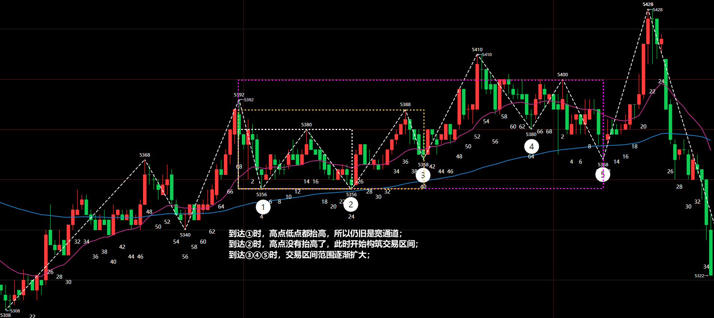

#### 市场状态划分的多义性

##### 交易区间切割

还是以上面的纸浆2605合约5分钟走势图为例，同一张图可以有多种划分方式，这些方式都是可以的。

由于斜率较小的宽通道和交易区间很近似，所以很多时候会有多种划分方式。

方式一：把前面两段划分给宽通道，交易区间范围缩小，价格可以看到大概在交易区间中运行，所以这种划分方式会更贴切走势一些。

方式二：以中间某段连接两个交易区间，显示出价格重心上移的现象，也是可以的。

##### 宽通道和交易区间的界限是模糊的

宽通道如果斜率较大，那么很明显是趋势。但如果宽通道如果斜率较小，虽然高低点都同向运动，但特征序列重合较高，此时显示为弱趋势，和交易区间就很接近了。

对于斜率较小、特征序列重合较高的宽通道，在和交易区间的分辨中模糊是正确的。

如图是甲醇2605合约5分钟走势图，可以看到可以有两种划分方式：

方式一：以上涨趋势看，高低点都抬高，所以交易区间以第一次破坏趋势条件进行划分。

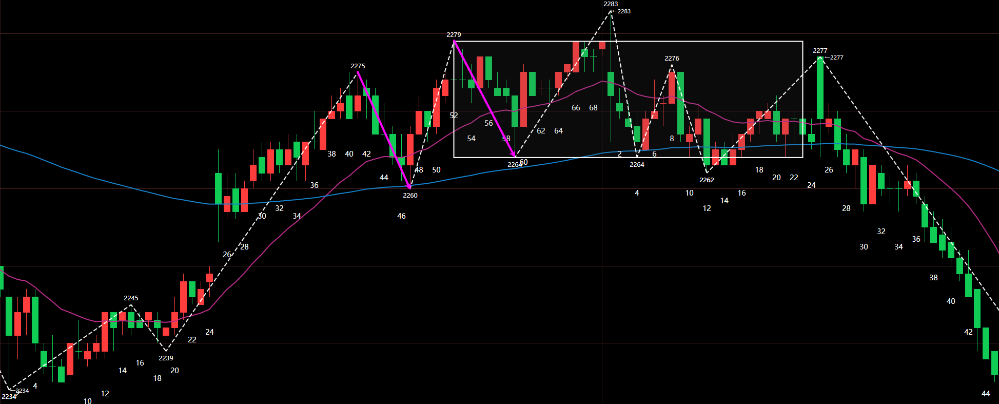

方式二：特征序列的重合度较高，所以也可以认为其包含在交易区间内部。

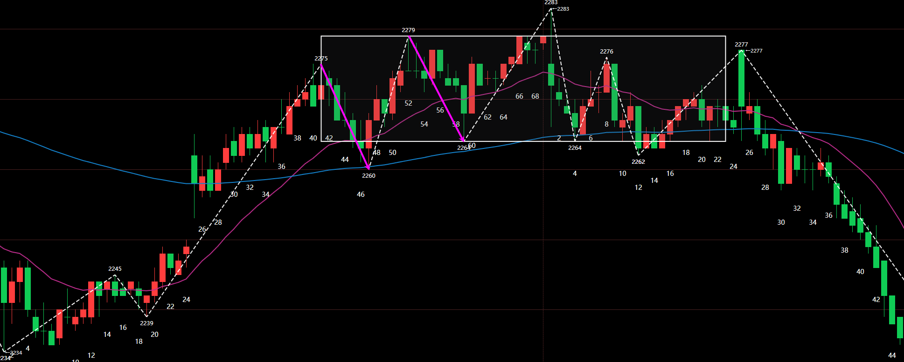

#### 第二段陷阱

**在交易区间中，80%的突破会失败**。

某些时候看到价格经过两次上涨或下跌段要突破前高或前低时，会出现假突破导致价格重新回到交易区间中。

**在交易区间中，看到价格强势突破高低点后贸然追多或追空，会导致被套**。同时由于对高低点的突破，会让挂单的空头或多头止损离场。

#### 交易区间的终结

1.突破回调不进入交易区间内

2.突破或窄通道超过交易区间2倍幅度位置

### 通道

#### 突破演变为通道

**回调是通道的开始**。当出现回调时候，可以确认突破状态结束了，然后根据回调的尺度来判定后续是窄通道还是宽通道。

| 回调类型   | 特征                                                         | 结果           |
| ---------- | ------------------------------------------------------------ | -------------- |
| 浅回调     | 回调3根K线以内，上涨突破的回调未下破EMA20，下跌突破的回调未上破EMA20，未达新段构成标准 | 演变为窄通道   |
| 深回调     | 回调5~20根K线，上涨突破的回调下破EMA20，下跌突破的回调上破EMA20，达到新段的构成标准 | 演变为宽通道   |
| 无休止回调 | 回调超过20根K线，上涨突破的回调下破EMA20，下跌突破的回调上破EMA20，达到新段的构成标准 | 演变为交易区间 |

#### 小心宽通道的第三推

- 宽通道作为牛旗熊旗

- 宽通道作为顶底

1.当宽通道作为牛旗时，反向通道作为回调，那么第三推意味着整个反向通道回调的结束。

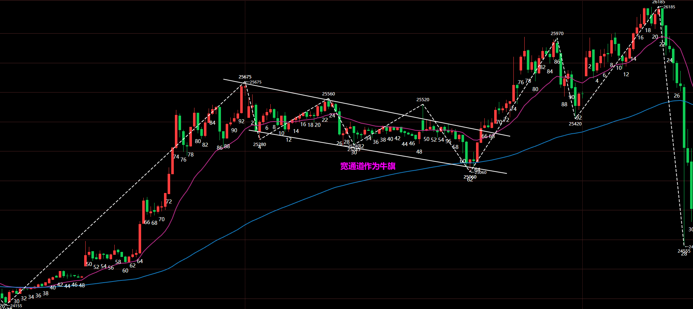

#### 通道演变为交易区间

宽通道和交易区间的共同点都是多段结构，不同点是宽通道还是趋势类型，是有明确方向的，交易区间是盘整类型，无明确方向。

**通道演变为交易区间的过程，就是趋向性逐步减弱的过程**。

## 趋势反转

### 趋势反转的左侧图形

#### 三推楔形

##### 1.标准三推楔形结构

如图是纸浆2605合约5分钟走势图，此处通道构成三推楔形，可以明显看到上涨力量衰弱，随后上涨通道结构结束，开启下跌趋势。

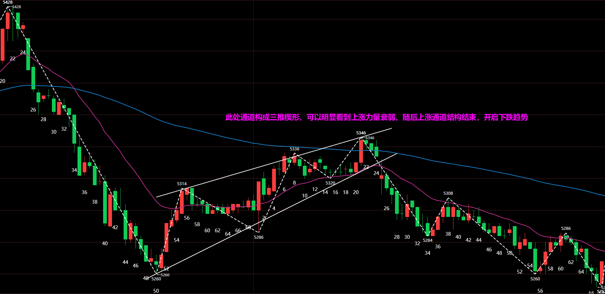

##### 2.头肩顶/头肩底

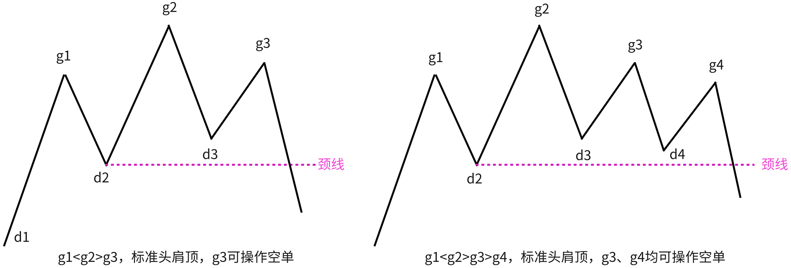

如图是甲醇2605合约5分钟走势图，走势在进入交易区间后，形成头肩顶结构。从后续看，当前头肩顶完成趋势反转。

#### 双顶/双底

##### 1.标准双顶/双底

如图是焦煤2605合约5分钟走势图，可以看到第一处是以双底结构完成趋势反转的，两次价格到达同一位置附近时候受到较强支撑，最终促成趋势反转。

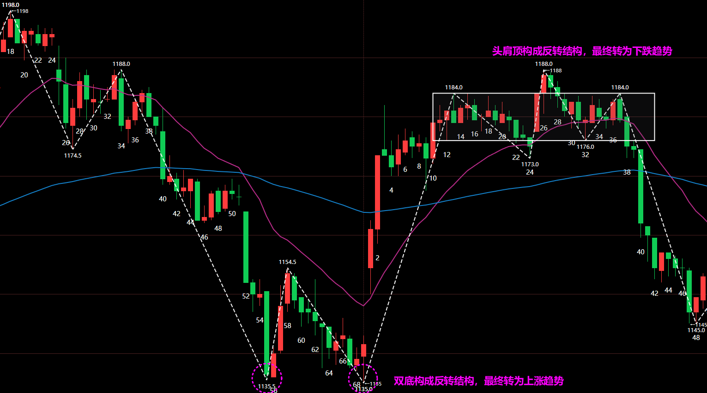

如图是焦煤2605合约5分钟走势图，可以看到虽然第二次上涨段最高价比前上涨段低，但也构成双顶反转结构，最终转为下跌趋势。

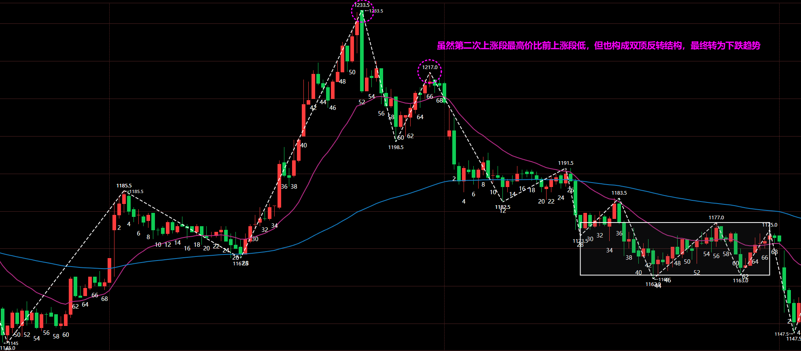

##### 2.双顶/双底后加速

如图是甲醇2605合约5分钟走势图，可以看到构成双顶结构，但趋势并没有再次反转，而是随后迎来一段加速上涨，耗尽最后一点多头力量，随后趋势反转开启下跌。

#### 二次衰竭

如图是多晶硅2605合约5分钟走势图，可以看到价格在上涨趋势后逐渐演变为交易区间，但**在交易区间内，两次上涨段高点依次降低，构成多头二次衰竭结构**，此处是不错的开空位置。

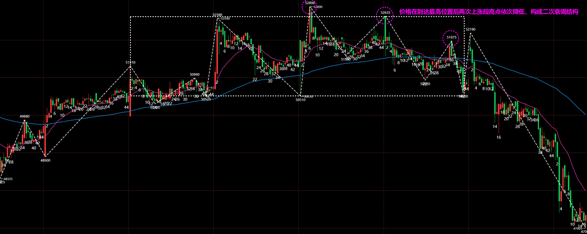

### 趋势反转的右侧判定

### 提前判断趋势方向

当出现突破或窄通道时候，应该想到趋势方向可能改变了，此时若是不确定，可以不操作，持仓可以平仓离场。

## 交易操作

### ⭐市场背景和交易方式

交易操作的第一步，也是最重要的一步，就是**判断当前市场处于何种状态？是否正演变为其他状态？**

在现实的市场中，市场状态的演变不一定是相邻的，很有可能是跳跃式的。比如当前是多头窄通道状态，经过回调后产生不破前高的第3段，后续就可能直接演变为下跌宽通道状态。

| 市场背景             | 交易方式                                 |
| -------------------- | ---------------------------------------- |
| 宽幅交易区间         | 剥头皮交易，区间上1/3开空，区间下1/3开多 |
| 窄幅交易区间         | 不操作                                   |
| 多头宽通道 | 剥头皮交易，区间下1/2开多，不开空        |
| 空头宽通道 | 剥头皮交易，区间上1/2开空，不开多        |
| 多头窄通道           | 波段交易，只等回调做多 |
| 空头窄通道           | 波段交易，只等回调做空 |
| 多头突破             | 波段交易，随时做多 |
| 空头突破             | 波段交易，随时做空 |

### 波段交易

### 剥头皮交易

- 主趋势反转

- 趋势后期

- 突破交易

- 高潮反转

- 宽通道

- 窄通道
- 交易区间

## 交易者的自身

### 心理的不适感

交易中最难是等待，等待分为两个部分，一个是等待交易机会出现，另一个是等待行情演变。

做日内交易，盯盘找机会，因此需要等待，很多时候等待一个开仓机会，需要较长时间，这个过程是未持仓的，所以其实还好。而很多时候盲目开仓，是因为其他交易单亏损较多或者赚钱了开始得瑟，受情绪控制而不按交易系统开仓。所以这种情况相对容易控制些，本来没有持仓，如果心理不适，就不做罢了。

难的是持仓等待行情演变，开仓了就有了心理成本，但价格不一定总是按照预期较大幅度运动。开仓后浮亏，不爽！开仓后上下震荡，感觉花那么长时间等待机会没结果，不爽！浮盈后开始回撤，不爽！**亏损造成的心理极度不适感才是在这个市场大多数人亏损的原因**。这种亏损不仅仅是账户金额上，还有等待开仓和持仓盯盘的时间成本，忙活了这么久，最终一毛没赚，反而亏了，就会很不爽。

在持仓过程中，只有一种情况是爽的，那就是价格按照预期方向较大幅度运动，账户开始大幅浮盈，觉得努力没有白费。其他时候都是不爽的，最终就是没有很快浮盈就会不爽。但可惜的是，市场出现突破和窄通道的时机毕竟占少数情况，大部分情况就是宽通道和交易区间，所以大部分情况心理就很不舒服。每次开仓，都是预期盈利的，这是废话，不预期盈利，难道预期亏损？可正是这些盈利预期导致自身情绪被牵着。

仔细想想，我舒不舒服，和市场行情走向有个屁关系，市场行情不会因为我的个人意志转移，那我所谓的情绪在交易中毫无价值，甚至是绊脚石。所以要放弃预期，不再关注每笔交易的得失，更应该去关注操作是否符合交易系统的标准，开仓结构、开仓信号符合不？平仓离场符合标准不？这才是最重要的。

### 交易不必完美

没有人能做到100%胜率，所以交易中必然有亏损单子，亏了就亏了，不必纠结，只要符合交易系统标准，那就是合理存在的。

在交易中，也没有人能完美的开仓在趋势启动位置，平仓在趋势完结位置，很多时候浪费一些行情也是很正常的。刻意的去纠结操作在完美位置，反而会造成操作变形，让系统变得过拟合。比起赚多少，更重要的是尽量少亏损，当亏损控制好了，回撤就控制好了，那么当盈利单出现，就会带动账户增长。

