# 期货短线交易系统v2版

## 走势结构划分

## 回调

### 回调的形成及要求

回调的形成：上涨/下跌**趋势**中，多头/空头投资者为了防止风险过大会逐步获利了结，市场就会出现回调，并可能陷入横盘整理。

回调的最低要求：

- 上涨趋势中的回调：指某根 K 线的最低点低于前一根 K 线的最低点。
- 下跌趋势中的回调：指某根 K 线的最高点高于前一根 K 线的最高点。

回调交易的目的：**回调是趋势中的暂时停顿，为交易者提供高胜率的入场机会**。

### 趋势尝试恢复

#### 数K线

上涨/下跌趋势中，将尝试恢复上涨/下跌的信号点进行数字标记。恢复上涨标记为`H(num)`，恢复下跌标记为`L(num)`。

那么实际上出现恢复上涨/下跌的信号K线组合大多数就是那几种：

- 顶底分型
- 包含
- 长上影线且为阴线、长下影线且为阳线

这些K线组合表示价格到底某个位置后被反向拉回，受到另一方较强阻力。

如图是纸浆2605合约5分钟走势图，标记出上涨恢复的信号点。

#### H2/L2是高胜率入场点

1.双重力量推动：顺势交易者看到趋势恢复的第二次尝试会认为是高概率入场点；逆势交易者的回补行为进一步推动价格朝趋势方向发展。

2.供需失衡：H2买点，多头开仓买入和空头平仓买入，缺乏卖方；L2卖点，空头开仓卖出和多头平仓卖出，缺乏买方。这导致价格更容易向趋势方向移动。

### 50%回调

核心逻辑：在一段趋势段的50%位置，**顺势交易者和逆势交易者的潜在盈亏比是相同的**（1:1）（目标为前期高/低点，止损为波段起/终点）。

概率优势：在趋势背景下，顺势方的胜率更高（例如60% vs 40%）。这使得50%水平成为一个具有数学优势的、机构非常青睐的入场点。

应用：交易者常在上涨趋势的50%回调位挂限价单买入，或在下降趋势的50%反弹位挂限价单卖出。

如图是纸浆2605合约30分钟走势截图，也就是上图中的30分钟周期，可以看到很多次回调到底50%附近，然后继续之前的趋势。

### 回调时间过长是风险

如果回调继续发展，可能会演变成相反的趋势。当回调增长到20或更多K线，则是无休止的回调，多头突破的可能性降低到与空头突破大致相同。

如图是棕榈油2605合约5分钟走势，本来是上涨趋势，因此会在H2附近入场做多，期望维持上涨趋势，但后续回调时间变长，不断出现H3、H4，回调演变成了空头趋势。

## 市场状态及演变

### 市场的4种状态

市场分为4种状态：**突破、窄通道、宽通道、交易区间**。

| 市场周期 | 特征                                                         | 交易策略                                                     |
| -------- | ------------------------------------------------------------ | ------------------------------------------------------------ |
| 突破     | 一段结构，方向明确，该段由**一系列强趋势K构成**，K线之间重叠很少，几乎没有回调。 | 方向唯一：顺突破方向交易，严禁逆势操作。 交易方式：波段交易。 |
| 窄通道   | 一段结构，方向明确，该段**回调短暂（1~3根K线）且幅度浅**。   | 方向唯一：顺突破方向交易，严禁逆势操作。 交易方式：波段交易。 |
| 宽通道   | 多段结构，方向明确，段作为回调，**回调深入且持久（5~20根K线）**。 | 双向机会：顺势逆势均可操作。 顺势交易：上涨宽通道回调买入或下跌宽通道反弹卖出。 逆势交易：剥头皮交易，区间上二分之一卖出，下二分之一买入。 |
| 交易区间 | 多段结构，**方向不明**，持续20根K线以上整理，**80%突破尝试会失败**。 | 双向机会：顺势逆势均可操作。 操作方式：高抛低吸，区间上三分之一卖出，下三分之一买入，以剥头皮为主，赚取小额利润。 |

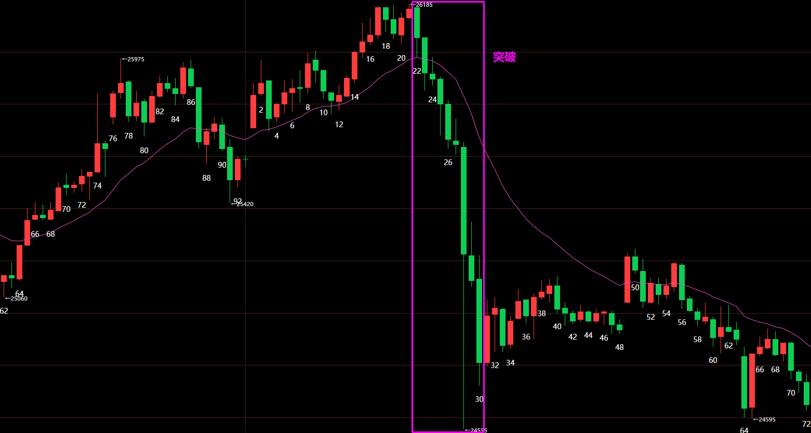

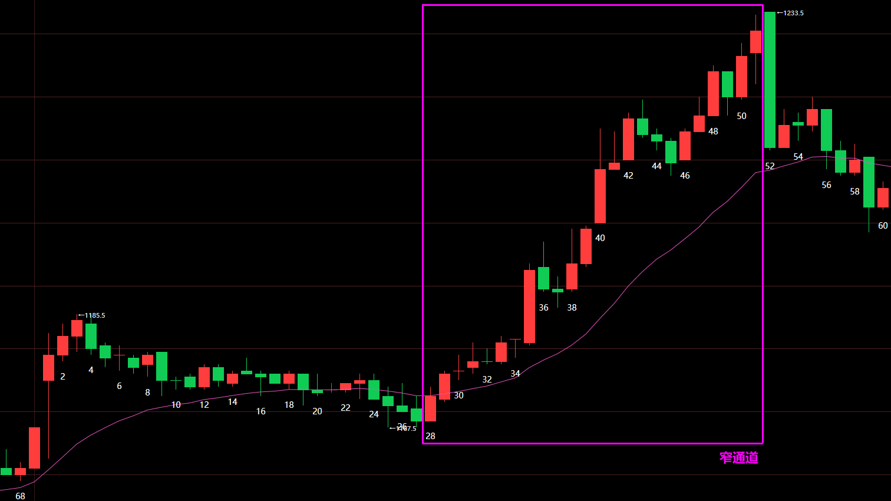

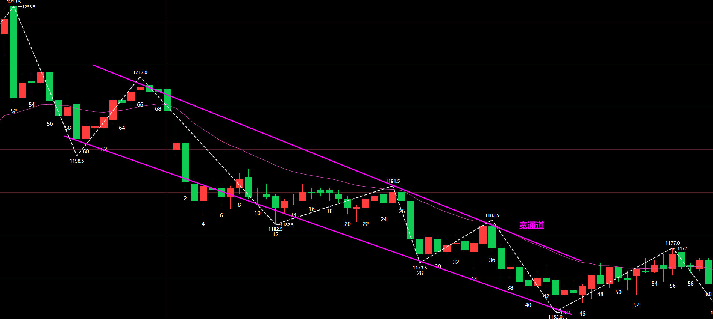

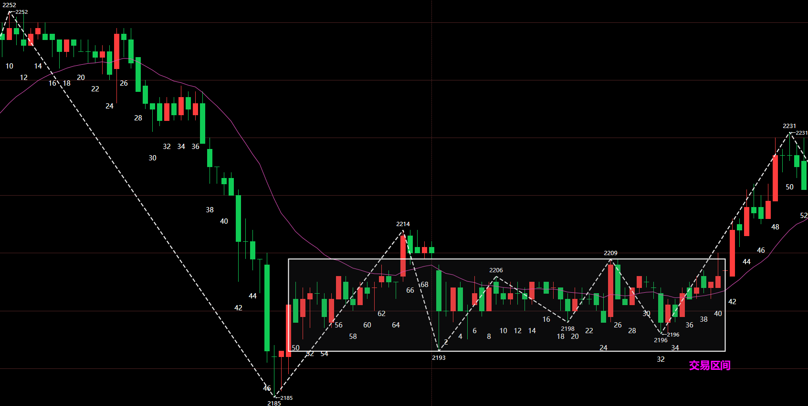

### 市场的2种走势类型

市场分为2种走势类型：**趋势和盘整**。

1. 趋势的高低点同向抬高或同向变低，显示为有方向；而盘整的高低点并不同向变化，显示为无方向。

2. 一段式结构一定是趋势，因为其内部构成趋向性。多段式结构需要根据段的高低点位置判断是否有趋向性。
3. **特征序列重叠范围越大，趋向性越弱；特征序列重叠范围越小，趋向性越强**。特征序列没有重叠范围，趋向性非常强。

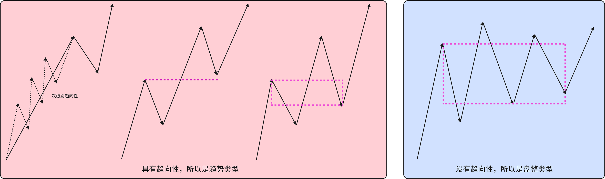

按照趋向性强度，可以这样排列，越靠近两端趋向性越强：

突破、窄通道是标准的趋势行情，交易区间是标准的盘整行情，而宽通道需要关注其斜率大小来判断趋向性如何。

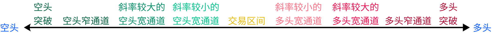

### 交易区间

#### 交易区间范围的确定

对于交易区间，范围**上轨定义为次高点，下轨定义为次低点**。

**在上涨趋势中，以下跌段为起始段；在下跌趋势中，以上涨段为起始段。**

如图是纸浆2605合约5分钟走势图，到达①处为蓝色范围，到达③处为黄色范围，到达⑤处为紫红色范围。

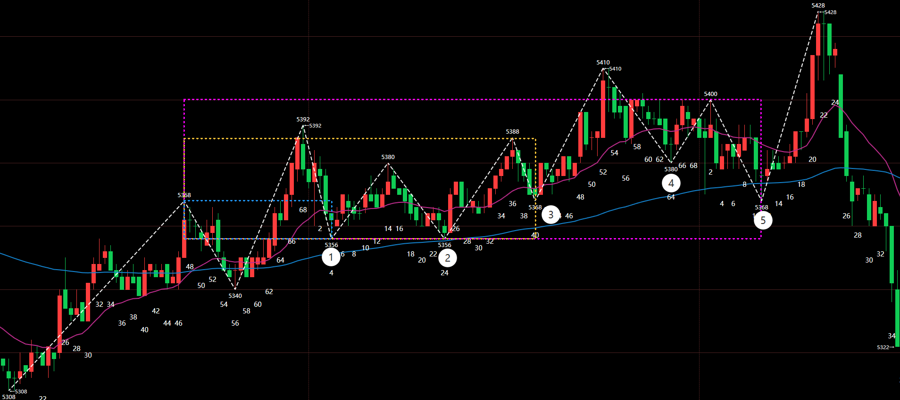

#### 状态划分的多义性

还是以上面的纸浆2605合约5分钟走势图为例，同一张图可以有多种划分方式，这些方式都是可以的。

由于斜率较小的宽通道和交易区间很近似，所以很多时候会有多种划分方式。

方式一：以大交易区间划分，虽然确定了上下轨，但可以观察到价格重心是上移的。

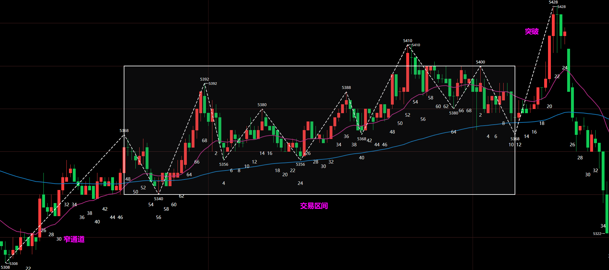

方式二：把前面两段划分给宽通道，交易区间范围缩小，价格可以看到大概在交易区间中运行，所以这种划分方式会更贴切走势一些。

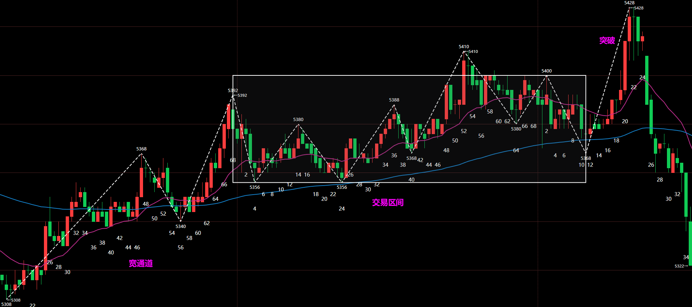

方式三：以中间某段连接两个交易区间，显示出价格重心上移的现象，也是可以的。

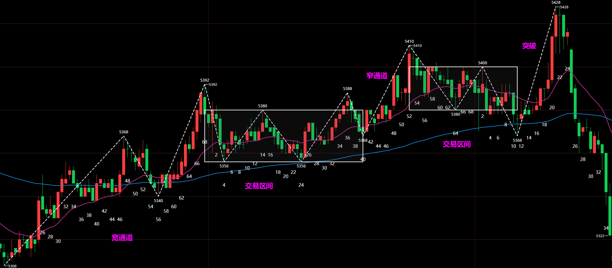

#### 第二段陷阱

**在交易区间中，80%的突破会失败**。

某些时候看到价格经过两次上涨或下跌段要突破前高或前低时，会出现假突破导致价格重新回到交易区间中。

**在交易区间中，看到价格强势突破高低点后贸然追多或追空，会导致被套**。同时由于对高低点的突破，会让挂单的空头或多头止损离场。

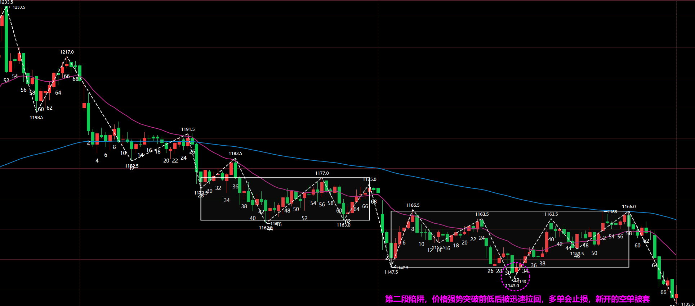

#### 交易区间的终结

1.突破回调不进入交易区间内

2.突破或窄通道超过交易区间2倍幅度位置

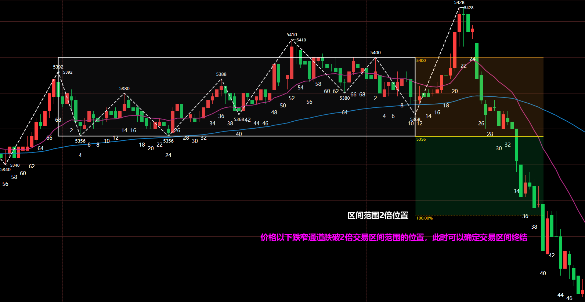

### 市场状态演变

#### 突破演变为通道

**回调是通道的开始**。当出现回调时候，可以确认突破状态结束了，然后根据回调的尺度来判定后续是窄通道还是宽通道。

| 回调类型   | 特征                                                         | 结果           |
| ---------- | ------------------------------------------------------------ | -------------- |
| 浅回调     | 回调3根K线以内，上涨突破的回调未下破EMA20，下跌突破的回调未上破EMA20，未达新段构成标准 | 演变为窄通道   |
| 深回调     | 回调5~20根K线，上涨突破的回调下破EMA20，下跌突破的回调上破EMA20，达到新段的构成标准 | 演变为宽通道   |
| 无休止回调 | 回调超过20根K线，上涨突破的回调下破EMA20，下跌突破的回调上破EMA20，达到新段的构成标准 | 演变为交易区间 |

#### 通道演变为交易区间

宽通道和交易区间的共同点都是多段结构，不同点是宽通道还是趋势类型，是有明确方向的，交易区间是盘整类型，无明确方向。

**通道演变为交易区间的过程，就是趋向性逐步减弱的过程**。

#### 交易区间产生突破

## 支撑和阻力位

## 交易操作

### ⭐市场背景的判断

交易操作的第一步，也是最重要的一步，就是判断当前市场处于何种状态？是否正演变为其他状态？

在现实的市场中，市场状态的演变不一定是相邻的，很有可能是跳跃式的。比如当前是多头窄通道状态，经过回调后产生不破前高的第3段，后续就可能直接演变为下跌宽通道状态。

### 波段交易

### 剥头皮交易

- 主趋势反转

- 趋势后期

- 突破交易

- 高潮反转

- 宽通道

- 窄通道
- 交易区间
